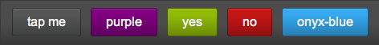
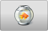
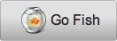
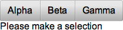
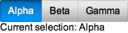

% Buttons

The Onyx library provides a rich assortment of buttons for use in your Enyo
applications.  This document surveys the types of buttons that you are most
likely to use.

## onyx.Button

[onyx.Button](../../api.html#onyx.Button) derives directly from
[enyo.Button](../../api.html#enyo.Button) and provides the same basic
functionality, along with a modicum of visual styling.

        {kind: "onyx.Toolbar", components: [
            {kind: "enyo.Button", content: "enyo.Button"},
            {kind: "onyx.Button", content: "onyx.Button"}
        ]}

When an `onyx.Button` is tapped, it generates an `ontap` event; you may respond
to the event by specifying a handler method, e.g.:

        {kind: "onyx.Button", content: "tap me", ontap: "buttonTapped"},

        ...

        buttonTapped: function(inSender, inEvent) {
            // respond to the tap event
        }

In addition, you may customize the look of a button by specifying foreground and
background colors, or by applying one of Onyx's built-in button styles:

        {kind: "onyx.Toolbar", components: [
            {kind: "onyx.Button", content: "tap me"},
            {kind: "onyx.Button", content: "purple", style: "background-color: purple; color: #F1F1F1;"},
            {kind: "onyx.Button", content: "yes", classes: "onyx-affirmative"},
            {kind: "onyx.Button", content: "no", classes: "onyx-negative"},
            {kind: "onyx.Button", content: "onyx-blue", classes: "onyx-blue"}
        ]}

You may also place an image inside a button, with or without accompanying text,
as in the following examples:

        {kind: "onyx.Button", ontap:"buttonTapped", components: [
            {kind: "onyx.Icon", src: "https://github.com/enyojs/enyo/wiki/assets/fish_bowl.png"}
        ]}

        {kind: "onyx.Button", ontap:"buttonTapped", components: [
            {tag: "img", attributes: {src: "https://github.com/enyojs/enyo/wiki/assets/fish_bowl.png"}},
            {content: "Go Fish"}
        ]}

## onyx.IconButton

Similar effects may be achieved using
[onyx.IconButton](../../api.html#onyx.IconButton), a subkind of
[onyx.Icon](../../api.html#onyx.Icon).  For instance, the code

        {kind: "onyx.IconButton", src: "assets/my_icon.png"}

yields an icon that acts like a button, but is not displayed against the shaded
rectangular background generally associated with buttons.

You may also use `onyx.Icon` to create a button with both text and an image:

        {kind: "onyx.Button", ontap: "buttonTap", components: [
            {kind: "onyx.Icon", src: "assets/my_icon.png"},
            {content: "tap me"}
        ]}

A key difference between `onyx.IconButton` and `onyx.Button` is that the image
associated with the IconButton's `src` property is assumed to be a 32x64-pixel
strip, with the top half showing the button's normal state and the bottom half
showing its state when active.  (By contrast, when you activate an `onyx.Button`
that contains an image, the state change is reflected in the button's
background, but not in the image itself.)

## onyx.RadioButton

In Enyo 2, an [onyx.RadioButton](../../api.html#onyx.RadioButton) is an
`enyo.Button` designed to go inside an
[onyx.RadioGroup](../../api.html#onyx.RadioGroup) (a
horizontally-oriented group of buttons in which tapping on one button will
release any previously-tapped button).

Let's look at how a radio group works.

        enyo.kind({
            name: "RadioGroupSample",
            kind: "Control",
            components: [
                {kind: "onyx.RadioGroup", onActivate: "radioActivated", components: [
                    {content: "Alpha"},
                    {content: "Beta"},
                    {content: "Gamma"}
                ]},
                {name: "statusText", content: "Please make a selection"}
            ],
            radioActivated: function(inSender, inEvent) {
                if (inEvent.originator.getActive()) {
                    this.$.statusText.setContent("Current selection: " +
                        inEvent.originator.getContent());
                }
            }
        });

Notice that we have one handler method for the entire radio group.  When a
button is tapped (or "activated"), we are able to identify the source of the
event using `inEvent.originator`.  So if we tap the "Alpha" button, we see the
following:

It's also worth noting that we didn't have to explicitly declare the kind for
our radio buttons.  When a new control is added to an `onyx.RadioGroup`, its
kind defaults to `onyx.RadioButton`.  (You can change this behavior by
explicitly setting the `defaultKind` property of the radio group.)

## onyx.ToggleButton

[onyx.ToggleButton](../../api.html#onyx.ToggleButton) is a control that
looks like a switch with labels for two states.  Each time a toggle button is
tapped, it switches its value and fires an `onChange` event.

        {kind: "onyx.ToggleButton", onContent: "foo", offContent: "bar",
            onChange: "buttonToggle"},

        ...
 
        buttonToggle: function(inSender, inEvent) {
            this.log("Toggled to value " + inEvent.value);
        }

You may customize the appearance of the toggle button's "on" state by setting
the background color as a CSS style:

        {kind: "onyx.ToggleButton", style: "background-color: #35A8EE;"}

Finally, you may retrieve the value of the button by calling the `getValue()`
method, which returns a Boolean, true or false:

        queryToggleValue: function() {
            return this.$.toggleButton.getValue();
        }
