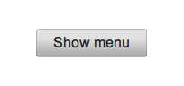
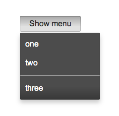

% Menus

## onyx.Menu

[onyx.Menu](../../api.html#onyx.Menu) is a subkind of
[onyx.Popup](../../api.html#onyx.Popup) that displays a list of
[onyx.MenuItem](../../api.html#onyx.MenuItem) objects and looks like a
popup menu.  It is meant to be used in conjunction with an
[onyx.MenuDecorator](../../api.html#onyx.MenuDecorator).  The decorator
couples the menu with an activating control, which may be a button or any other
control with an `onActivate` event.  When the control is activated, the menu
shows itself in the correct position relative to the activator.

        {kind: "onyx.MenuDecorator", onSelect: "itemSelected", components: [
            {content: "Show menu"},
            {kind: "onyx.Menu", components: [
                {content: "one", value: "1"},
                {content: "two", value: "2"},
                {classes: "onyx-menu-divider"},
                {content: "three", value: "3"}
            ]}
        ]}

Typically, you'll want to handle the `onSelect` event that a menu item fires
when selected.  This event contains a reference to the originating menu item
(`inEvent.originator`).

If the menu item is a simple instance of `onyx.MenuItem` (as in our example),
you may use `inEvent.originator` in your handler method to obtain the values of
relevant properties such as `content` or `value`:

        itemSelected: function(inSender, inEvent) {
            if (inEvent.originator.content) {
                itemContent = inEvent.originator.content;
                // do something with itemContent
                ...
            }
        }

If you've created a menu in which each menu item is a kind with subcomponents
(e.g., an [onyx.IconButton](../../api.html#onyx.IconButton) plus an
`onyx.MenuItem`), you'll need to perform the extra step of identifying the
originating menu item before you can retrieve property values from it.  For
instance, if each menu item looks like this...

        {components: [
            {kind: "onyx.IconButton", src: "assets/<someIcon>.png"},
            {content: "<someContent>", value: "{someValue}"}
        ]}

...then your handler method might look like this:

        itemSelected: function(inSender, inEvent) {
            if (inEvent.selected) {
                itemContent = inEvent.selected.controlAtIndex(1).content;
                itemValue = inEvent.selected.controlAtIndex(1).value;
                // do something with itemContent and/or itemValue
                ...
            }
        }

A menu may be "floated" by setting its `floating` property to `true`.  When a
menu is not floating (the default), it will scroll along with the activating
control, but may be obscured by surrounding content with a higher z-index.  When
floating, the menu will never be obscured, but it will not scroll along with the
activating control.

In addition, by default, menus are placed in a scroller and will attempt to size
the scroller so that the full menu can be used at any screen height.  Set the
`scrolling` property to `false` during instantiation to use a static menu
instead.