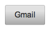
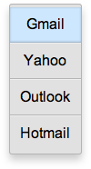

% Pickers

## onyx.Picker

[onyx.Picker](../../api.html#onyx.Picker), a subkind of
[onyx.Menu](../../api.html#onyx.Menu), is used to display a list of
items that can be selected.  It is meant to be used in conjunction with an
[onyx.PickerDecorator](../../api.html#onyx.PickerDecorator).  The
decorator loosely couples the picker with an
[onyx.PickerButton](../../api.html#onyx.PickerButton)--a button that,
when tapped, shows the picker.  Once an item is selected, the list of items
closes, but the item stays selected and the PickerButton displays the choice
that was made.

        enyo.kind({
            name: "PickerSample",
            kind: "FittableRows",
            components: [
                {kind: "onyx.PickerDecorator", onSelect: "itemSelected", components: [
                    {}, // A content-less PickerButton
                    {kind: "onyx.Picker", components: [
                        {content: "Gmail", active: true},
                        {content: "Yahoo"},
                        {content: "Outlook"},
                        {content: "Hotmail"}
                    ]}
                ]}
            ],
            itemSelected: function(inSender, inEvent) {
                // Do something with the selected MenuItem and its content
                menuItem = inEvent.selected;
                menuItemContent = inEvent.content;
                ...
            }
        });

Note that the above example includes an empty (content-less) component as the
first item inside the PickerDecorator.  By looking at the `defaultKind` of
`onyx.PickerDecorator`, we can tell that this control--the activating control
for the PickerDecorator--is an `onyx.PickerButton`.

As noted earlier, when the selected item changes, the PickerButton displays the
content of the new selection.  However, it's also possible to have the Picker
display a button with static content.  To do this, we define the activating
control as an [onyx.Button](../../api.html#onyx.Button):

        {kind: "onyx.Button", content: "Choose one", style: "width: 150px;"}

Now, regardless of which menu item is selected, unless the PickerDecorator is in
its active state (i.e., the user has tapped the menu and is about to make a
selection), the user always sees the following:

