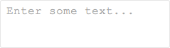
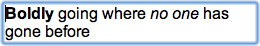
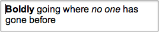

# Text Fields

## enyo.Input

[enyo.Input](http://enyojs.com/api/#enyo.Input) is an
[enyo.Control](http://enyojs.com/api/#enyo.Control) that implements an HTML
`<input>` element with cross-platform support for change events.

You can listen for the `oninput` and `onchange` DOM events to know when the text
inside an Input has been modified.  `oninput` fires immediately, while
`onchange` fires when the text has changed and the input loses focus.

        components: [
            {kind: "enyo.Input", name: "myInput", placeholder: "Enter some text...",
                onchange: "inputChange"}
        ],
        inputChange: function(inSender, inEvent) {
            // retrieve new input value
            newInputValue = this.$.myInput.get("value");

            // do something in response
        }

As illustrated above, you may use the `placeholder` property to specify text to
be displayed when the input is empty.

Also, in the event handler method, you may access the value of the input by
calling `get()` (or `set()`) on it.

To create an input suitable for password entry, set the `type` property to
`"password"`.

Finally, two other properties of `enyo.Input` deserve mention.  By setting the
`disabled` property to `true`, you can prevent the user from entering anything
into the input (presumably on a temporary basis).  And by setting `defaultFocus`
to `true`, you can make the input take focus when rendered.  (Note that you
should only do this for one input.)

## onyx.Input

[onyx.Input](http://enyojs.com/api/#onyx.Input) derives from `enyo.Input` and
provides the same functionality with added visual styling.

Typically, an `onyx.Input` is placed inside an
[onyx.InputDecorator](http://enyojs.com/api/#onyx.InputDecorator), e.g.:

        {kind: "onyx.InputDecorator", components: [
            {kind: "onyx.Input", placeholder: "Enter some text...", onchange: "inputChange"}
        ]}

## enyo.TextArea

[enyo.TextArea](http://enyojs.com/api/#enyo.TextArea) is an `enyo.Input` that
implements an HTML `<textarea>` element with cross-platform support for change
events.

`enyo.TextArea` is functionally equivalent to `enyo.Input`; one interacts with
it through the same events (`onchange`, `oninput`) and properties (`value`,
`placeholder`, `type`, `disabled`, `defaultFocus`).

A TextArea differs from an Input mainly in that the text field it displays spans
multiple lines.

        {kind: "enyo.TextArea", placeholder: "Enter some text...", onchange: "textChange"}

## onyx.TextArea

[onyx.TextArea](http://enyojs.com/api/#onyx.TextArea) derives from
`enyo.TextArea` and provides the same functionality with added visual styling.

Typically, an `onyx.TextArea` is placed inside an `onyx.InputDecorator`, e.g.:

        {kind: "onyx.InputDecorator", components: [
            {kind: "onyx.TextArea", placeholder: "Enter some text...", onchange: "textChange"}
        ]}

## enyo.RichText

[enyo.RichText](http://enyojs.com/api/#enyo.RichText) is a multi-line
`enyo.Input` that supports rich formatting, such as bold, italics, and
underlining.

        {kind: "enyo.RichText",
            value: "<b>Boldly</b> going where <i>no one</i> has gone before",
            style: "width: 250px;", defaultFocus: true, onchange: "textChange"}

As with Input and TextArea, the text displayed in a RichText may be accessed at
runtime via `get("value")` and `set("value", <new value>)`.

RichText also has `disabled` and `defaultFocus` properties that function just
like their counterparts in Input and TextArea.

`enyo.RichText` differs from Input and TextArea in having an `allowHtml`
property.  This is `true` by default, enabling HTML-based rich formatting.  Note
that the default setting allows *any* HTML to be inserted into the RichText,
including `<iframe>` and `<script>` tags.  Since this can be a security concern
in some situations, you have the option of setting `allowHtml` to `false`, in
which case any inserted HTML will be escaped.

RichText also differs from Input and TextArea by offering methods for
manipulating the current selection and the cursor position.  The Selection
operations and `insertAtCursor` method use the [HTML Editing
APIs](https://dvcs.w3.org/hg/editing/raw-file/tip/editing.html#selections).

In addition, RichText requires explicit sizing for width.

Note that RichText is not supported on Android < 3.

## onyx.RichText

[onyx.RichText](http://enyojs.com/api/#onyx.RichText) derives from
`enyo.RichText` and provides the same functionality with added visual styling.

Typically, an `onyx.RichText` is placed inside an `onyx.InputDecorator`, e.g.:

        {kind: "onyx.InputDecorator", components: [
            {kind: "onyx.RichText",
                value: "<b>Boldly</b> going where <i>no one</i> has gone before",
                style: "width: 250px;", defaultFocus: true, onchange: "textChange"}
        ]}

