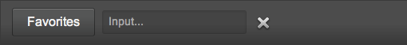
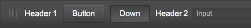
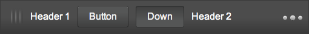
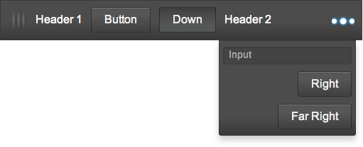

% Toolbars

## onyx.Toolbar

[onyx.Toolbar](../../api.html#onyx.Toolbar) is a a horizontal bar that
contains controls used to perform common UI actions.

A Toolbar customizes the styling of the controls it hosts, including buttons,
icons, and inputs, e.g.:

        {kind: "onyx.Toolbar", components: [
            {kind: "onyx.Button", content: "Favorites"},
            {kind: "onyx.InputDecorator", components: [
                {kind: "onyx.Input", placeholder: "Input..."}
            ]},
            {kind: "onyx.IconButton",
                src: "https://github.com/enyojs/enyo/wiki/assets/remove-icon.png"}
            ]
        }

Note that it's possible to style a set of controls to look like they are in a
toolbar without having the container itself look like a toolbar.  To do so,
apply the `"onyx-toolbar-inline"` CSS class to the container that houses the
controls.

In the following example, we apply the `onyx-toolbar-inline` style to a control
to create a toolbar-like appearance.  Then we wrap the result in a scroller to
make it horizontally-scrollable, so that the user can access the offscreen
"Right" and "Far Right" buttons.

        {kind: "Scroller", classes:"onyx-toolbar", touchOverscroll:false, touch:true, vertical:"hidden", style:"margin:0px;", thumb:false, components: [
            {classes: "onyx-toolbar-inline", style: "white-space: nowrap;", components: [
                {kind: "onyx.Grabber"},
                {content: "Header 1"},
                {kind: "onyx.Button", content: "Button"},
                {kind: "onyx.Button", content: "Down", classes: "active"},
                {content: "Header 2"},
                {kind: "onyx.InputDecorator", components: [
                    {kind: "onyx.Input", placeholder: "Input"}
                ]},
                {kind: "onyx.Button", content: "Right"},
                {kind: "onyx.Button", content: "Far Right"}
            ]}
        ]}

## onyx.MoreToolbar

A simpler way to deal with multiple items in a toolbar is to use an
[onyx.MoreToolbar](../../api.html#onyx.MoreToolbar). `onyx.MoreToolbar`
can adapt to different screen sizes by moving overflowing controls and content
into an [onyx.Menu](../../api.html#onyx.Menu), e.g.:

        {kind: "onyx.Toolbar", components: [
            {kind: "onyx.Grabber"},
            {content: "Header 1"},
            {kind: "onyx.Button", content: "Button"},
            {kind: "onyx.Button", content: "Down", classes: "active"},
            {content: "Header 2"},
            {kind: "onyx.InputDecorator", components: [
                {kind: "onyx.Input", placeholder: "Input"}
            ]},
            {kind: "onyx.Button", content: "Right"},
            {kind: "onyx.Button", content: "Far Right"}
        ]}

You may prevent a control from being moved to the menu by setting its
`unmoveable` property to `true` (the default is `false`).

In addition, you may customize the menu's visual styling by specifying values
for the `menuClass` and `movedClass` properties.  The former is a CSS class
applied to the menu as a whole, while the latter is a class applied to
individual controls that are moved to the menu.