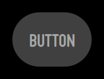
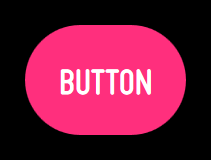
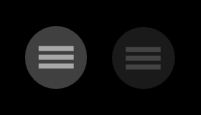

% Buttons

## Behavior

In Moonstone, a button will always be in one of four states:

1. **Normal** (up)

      

2. **Pressed** (down)

      
        
3. **Focused** (hover)

      

4. **Disabled** (dimmed)

      

When using a 5-way or Pointer remote, focusing and then pressing a button will
result in the execution of the corresponding action (upon release of the
button).

Note that the focused state may be animated.

## moonstone/Button

[moonstone/Button]($api/#/kind/moonstone/Button/Button) derives directly from
[enyo/Button]($api/#/kind/enyo/Button/Button) and provides the same basic
functionality, along with a dose of Moonstone visual styling.

When a `moonstone/Button` is tapped, it generates an `ontap` event; you may respond
to the event by specifying a handler method, e.g.:

```javascript
    var
        kind = require('enyo/kind'),
        Button = require('moonstone/Button');

    {kind: Button, content: 'tap me', ontap: 'buttonTapped'},

    ...

    buttonTapped: function(sender, event) {
        // respond to the tap event
    }
```

You may apply a caption to a button by wrapping it inside a
[moonstone/CaptionDecorator]($api/#/kind/moonstone/CaptionDecorator/CaptionDecorator):

```javascript
    var
        kind = require('enyo/kind'),
        Button = require('moonstone/Button'),
        CaptionDecorator = require('moonstone/CaptionDecorator'),
        Scroller = require('moonstone/Scroller');

    components: [
        {name: 'scroller', kind: Scroller, fit: true, touch: true, components: [
            {classes: 'moon-button-sample-wrapper', components: [
                {kind: CaptionDecorator, side: 'top', content: 'Pow', components: [
                    {name: 'Captioned Button A', kind: Button,
                        content: 'A', ontap: 'buttonTapped'}
                ]},
                {kind: CaptionDecorator, side: 'right', content: 'Boom', components: [
                    {name: 'Captioned Button B', kind: Button,
                        content: 'B', ontap: 'buttonTapped'}
                ]},
                {kind: CaptionDecorator, side: 'bottom', content: 'Crash', components: [
                    {name: 'Captioned Button C', kind: Button,
                        content: 'C', ontap: 'buttonTapped'}
                ]},
                {kind: CaptionDecorator, side: 'left', content: 'Bang', components: [
                    {name: 'Captioned Button D', kind: Button,
                        content: 'D', ontap: 'buttonTapped'}
                ]}
            ]}
        ]}
    ]
```


You may create a button with smaller visible dimensions (but a normal-sized tap
target) by setting `small: true` when declaring the button.

## moonstone/IconButton

[moonstone/IconButton]($api/#/kind/moonstone/IconButton/IconButton), which
extends the [moonstone/Icon]($api/#/kind/moonstone/Icon/Icon) kind, provides a
button with an image inside.

```javascript
    var
        kind = require('enyo/kind'),
        IconButton = require('moonstone/IconButton');

    components: [
        {kind: IconButton, src: 'assets/icon-list.png',
            ontap: 'buttonTapped'},
        {kind: IconButton, src: 'assets/icon-list.png',
            ontap: 'buttonTapped', disabled: true}
    ]
```



To create a button with an image and accompanying text inside, use a
`moonstone/Icon` as a component inside a `moonstone/Button`.
