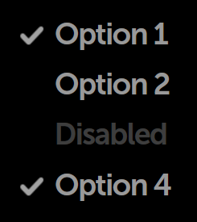

% Checkboxes

## Behavior

Checkboxes are used to select multiple items from a range of options.  In
Moonstone, the selected state is represented visually as a checkmark, while the
unselected state is the absence of a checkmark (i.e., there is no visual
marker).

Single selection from a range of options is implemented via [radio
items](radio-items.html) (otherwise known as radio buttons).

## enyo/Checkbox

[enyo/Checkbox]($api/#/kind/enyo/Checkbox/Checkbox) implements an HTML
checkbox input, with support for grouping.

The `onActivate` event is fired when the checkbox is tapped.

The state of the checkbox is available as a boolean (`true` if checked;
`false` if not) in the `checked` property.

## moonstone/Checkbox and moonstone/CheckboxItem

[moonstone/Checkbox]($api/#/kind/moonstone/Checkbox/Checkbox) extends
`enyo/Checkbox`, adding Moonstone visual styling.

Instead of creating `moonstone/Checkbox` objects directly, you may find it
convenient to use [moonstone/CheckboxItem]($api/#/kind/moonstone/CheckboxItem/CheckboxItem),
which combines a checkbox with a text label, as in this example taken from the
Enyo Sampler:

```javascript
    var
        kind = require('enyo/kind'),
        CheckboxItem = require('moonstone/CheckboxItem');

    components: [
        {classes: 'checkbox-sample-wrapper', components: [
            {kind: CheckboxItem, content: 'Option 1', checked: true},
            {kind: CheckboxItem, content: 'Option 2'},
            {kind: CheckboxItem, disabled: true, content: 'Disabled'},
            {kind: CheckboxItem, content: 'Option 4', checked: true}
        ]}
    ]
```



## moonstone/FormCheckbox

[moonstone/FormCheckbox]($api/#/kind/moonstone/FormCheckbox/FormCheckbox)
extends `moonstone/Checkbox`, providing a labeled checkbox (similar to
`moonstone/CheckboxItem`) for use in form layouts.  Unlike
`moonstone/CheckboxItem`, `moonstone/FormCheckbox` has a circular "tap target"
area that is always visible, regardless of whether the checkbox is currently
checked.

```javascript
    var
        kind = require('enyo/kind'),
        Divider = require('moonstone/Divider'),
        FormCheckbox = require('moonstone/FormCheckbox');

    components: [
        {kind: Divider, content: 'FormCheckbox Items (Default)'},
        {kind: FormCheckbox, content: 'Option 1', checked: true,
            onchange: 'itemChanged'},
        {kind: FormCheckbox, content: 'Option 2', onchange: 'itemChanged'},
        {kind: FormCheckbox, disabled: true, content: 'Disabled',
            onchange: 'itemChanged'}
    ]
```


