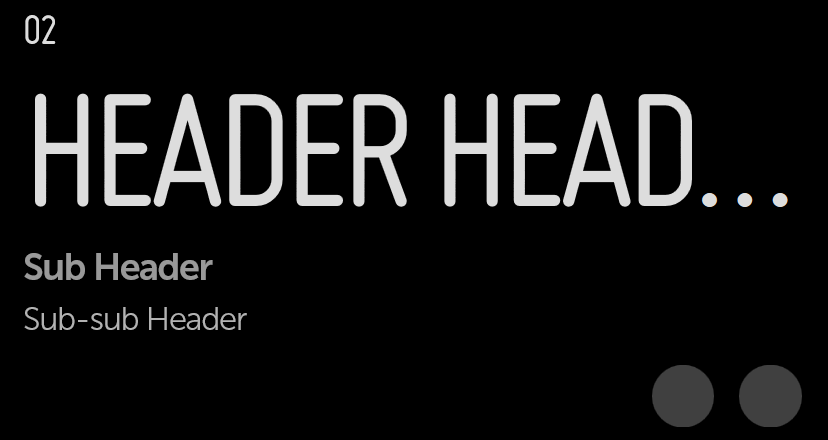

% Headers

## moonstone/Header

[moonstone/Header]($api/#/kind/moonstone/Header/Header) provides a styled header
with optional text above and below.

```javascript
    var
        kind = require('enyo/kind'),
        Header = require('moonstone/Header'),
        IconButton = require('moonstone/IconButton');

    {kind: Header, name: 'bigHeader', content: 'Header Header Header',
        titleAbove: '02', titleBelow: 'Sub Header',
        subTitleBelow: 'Sub-sub Header', classes: 'moon-10h', components: [
            {kind: IconButton, src: '../patterns-samples/assets/icon-like.png',
                ontap: 'likeBig'},
            {kind: IconButton, src: '../patterns-samples/assets/icon-next.png',
                ontap: 'shareBig'}
        ]
    }
```



Note that you can create a header whose title is also a text input field; to do
this, set the `inputMode` property to `true`.
