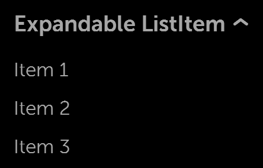
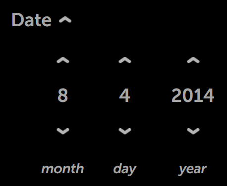
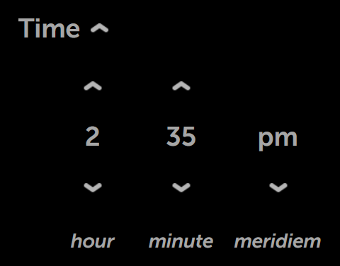

% Pickers

## moonstone/SimplePicker

[moonstone/SimplePicker]($api/#/kind/moonstone/SimplePicker/SimplePicker) is a
basic picker that allows the user to select items from a list.

In 5-way mode, the arrows are focusable and change the selection when pressed.
(Selection state is remembered.)

In pointer mode, the user points at arrows and clicks to change the selection.

This control may be used to select from a short list of options.  Since only one
item is visible at a time, it is recommended that the simple picker be used in
situations where the options are limited and easily understood.  For example, it
is appropriate to use this picker to make a selection from a list of time zones
or from a short list of languages; it is not appropriate to use SimplePicker
with long, data-driven lists.


## moonstone/SimpleIntegerPicker

[moonstone/SimpleIntegerPicker]($api/#/kind/moonstone/SimpleIntegerPicker/SimpleIntegerPicker)
is a control that prompts the user to make a selection from a range of
integer-based options.

The picker may be changed programmatically by calling `previous()` or `next()`,
or by modifying the published property `value`.

Visually, SimpleIntegerPicker is similar to SimplePicker, with the currently
selected value flanked by navigation arrows on each side.

```javascript
    var
        kind = require('enyo/kind'),
        SimpleIntegerPicker = require('moonstone/SimpleIntegerPicker');

    {
        kind: SimpleIntegerPicker,
        name: 'picker1',
        value: 3,
        min: 1,
        max: 10,
        step: 1,
        unit: 'sec',
        onChange: 'changed'
    }
```


## moonstone/IntegerPicker

[moonstone/IntegerPicker]($api/#/kind/moonstone/IntegerPicker/IntegerPicker) is
a control used to display a list of integers and solicit a choice from the user.
The integers range from `min` to `max`.

To initialize the IntegerPicker to a particular value, set the `value` property
to the integer that should be selected, as in this example:

```javascript
    var
        kind = require('enyo/kind'),
        IntegerPicker = require('moonstone/IntegerPicker');

    {
        kind: IntegerPicker,
        value: 2013,
        min: 1900,
        max: 2100,
        onChange: 'changed'
    }
```


The picker may be changed programmatically by modifying the published properties
`value`, `min`, or `max`; this is done in the usual way, by calling `set()`
while passing in the name of the property and the desired new value.

## moonstone/ExpandableListItem

[moonstone/ExpandableListItem]($api/#/kind/moonstone/ExpandableListItem/ExpandableListItem)
is a control with an expanded state and a collapsed state.  As the name
suggests, ExpandableListItem is suitable for use within lists; it is also
important with respect to pickers, because a variety of Moonstone picker kinds
are derived from it.

A `moonstone/ExpandableListItem` displays a header while also allowing
additional content to be stored in an [enyo/Drawer]($api/#/kind/enyo/Drawer/Drawer);
when the header is selected, the drawer opens below.  The drawer is closed by
tapping on the header text or navigating (via 5-way) back to the top of the
drawer.

The control's child components may be of any kind; by default, they are
instances of [moonstone/Item]($api/#/kind/moonstone/Item/Item).

```javascript
    var
        kind = require('enyo/kind'),
        ExpandableListItem = require('moonstone/ExpandableListItem');

    components: [
        {kind: ExpandableListItem, content: 'This is an expandable list item', components: [
            {content: 'Item One'},
            {content: 'Item Two'},
            {content: 'Item Three'}
        ]}
    ]
```

  



## moonstone/ExpandablePicker

One important subkind of `moonstone/ExpandableListItem` is
[moonstone/ExpandablePicker]($api/#/kind/moonstone/ExpandablePicker/ExpandablePicker),
a drop-down picker menu that solicits a choice from the user.  The picker's child
components, instances of [moonstone/CheckboxItem]($api/#/kind/moonstone/CheckboxItem/CheckboxItem)
by default, provide the options for the picker.

```javascript
    var
        kind = require('enyo/kind'),
        ExpandablePicker = require('moonstone/ExpandablePicker');

    components: [
        {kind: ExpandablePicker, noneText: 'Nothing selected',
            content: 'Expandable Picker', components: [
                {content: 'English'},
                {content: 'Spanish', active: true},
                {content: 'French'},
                {content: 'German'},
                {content: 'Italian'}
            ]
        }
    ]
```

The currently selected item is available in the picker's `selected` property
and may be accessed in the normal manner, by calling `get('selected')` and
`set('selected', <value>)`.  Similarly, the index of the current selection is
available in `selectedIndex`.

The current selection appears beneath the label when the control is closed.

  

  

Like `moonstone/ExpandableListItem`, `moonstone/ExpandablePicker` may also be
used inline within lists.

## moonstone/ExpandableIntegerPicker

Another kind derived from `moonstone/ExpandableListItem` is
[moonstone/ExpandableIntegerPicker]($api/#/kind/moonstone/ExpandableIntegerPicker/ExpandableIntegerPicker),
a drop-down picker menu that prompts the user to make a selection from a range
of integer-based options.

The value of the currently selected item is available in the picker's `value`
property, while the content of the item is available in `content`.

```javascript
    var
        kind = require('enyo/kind'),
        ExpandableIntegerPicker = require('moonstone/ExpandableIntegerPicker');

    {
        kind: ExpandableIntegerPicker,
        noneText: 'Not Selected',
        autoCollapse: true,
        content: 'Integer Picker',
        value: 7,
        min: 3,
        max: 15,
        step: 1,
        unit: 'elephants'
    }
```

  

  

## moonstone/DatePicker

[moonstone/DatePicker]($api/#/kind/moonstone/DatePicker/DatePicker), yet another
subkind of `moonstone/ExpandableListItem`, contains fields that allow the user
to choose a day, month, and year.

An `onChange` event is fired whenever the user selects a new value for one of
the fields.  This event contains a standard JavaScript Date object representing
the current date.

```javascript
    var
        kind = require('enyo/kind'),
        DatePicker = require('moonstone/DatePicker');

    {
        kind: DatePicker,
        name: 'picker',
        noneText: $L('Pick a Date'),
        content: 'Date',
        onChange: 'changed',
        yearText: $L('year'),
        monthText: $L('month'),
        dayText: $L('day')
    }
```




## moonstone/TimePicker

The [moonstone/TimePicker]($api/#/kind/moonstone/TimePicker/TimePicker) control
has fields that allow the user to choose an hour value, minute value, and
optional meridiem (AM/PM) value.

Like `moonstone/DatePicker`, `moonstone/TimePicker` extends
`moonstone/ExpandableListItem`, so it has an expanded form and a collapsed form.
The expanded form is displayed when the picker has focus.

An `onChange` event is fired whenever the user selects a new value for one of
the fields.  This event contains a standard JavaScript Date object representing
the current date.

```javascript
    var
        kind = require('enyo/kind'),
        TimePicker = require('moonstone/TimePicker');

    {
        kind: TimePicker,
        name: 'picker',
        content: 'Time',
        meridiemEnable: true,
        onChange: 'changed',
        hourText: $L('hour'),
        minuteText: $L('minute'),
        meridiemText: $L('meridiem')
    }
```




## moonstone/Calendar

Though not descended from `moonstone/ExpandableListItem`,
[moonstone/Calendar]($api/#/kind/moonstone/Calendar/Calendar) does implement
picker functionality in the form of a monthly calendar, from which the user may
select a particular day.

Each Calendar instance features the month name at the top and a grid of days,
grouped into rows (one per week), below.  The header buttons are used to
navigate to the desired month; the desired day is selected by tapping on it.

```javascript
    var
        kind = require('enyo/kind'),
        Calendar = require('moonstone/Calendar');

    {kind: Calendar, name: 'calendar', onChange: 'changed'}
```


## moonstone/Calendar/CalendarDate

[moonstone/Calendar/CalendarDate]($api/#/kind/moonstone/Calendar/CalendarDate)
is a control that represents a single day; in a `moonstone/Calendar` control,
each day of the month is a separate CalendarDate instance.
