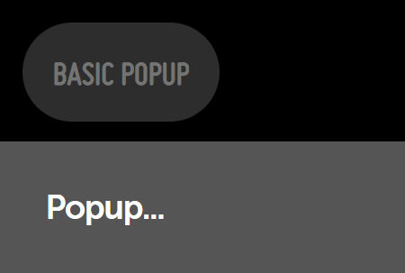
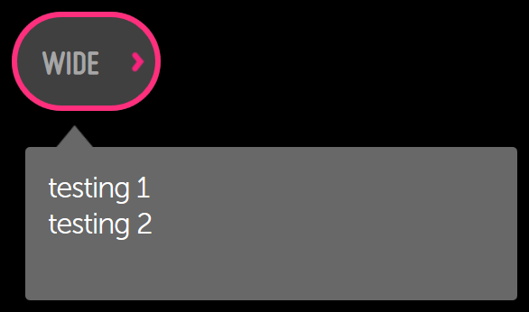

% Popups

## enyo.Popup

[enyo.Popup]($api/#/kind/enyo.Popup) is a control used to display certain
content on top of other content.  The following example shows a kind in which
pressing a button will display a popup.

```javascript
    enyo.kind({
        name: "PopupExample",
        style: "text-align: center;",
        components: [
            {kind: "enyo.Button", content: "Basic Popup", ontap: "showPopup"},
            {name: "basicPopup", kind: "enyo.Popup", floating: true, centered: true,
                style: "background-color: yellow; padding: 10px", onHide: "popupHidden", components: [
                    {content: "Popup..."}
                ]
            }
        ],
        showPopup: function(inSender, inEvent) {
            this.$.basicPopup.show();
        },
        popupHidden: function(inSender, inEvent) {
            // do something
        }
    });
```


Popups are initially hidden on creation; they can be shown by calling the
`show()` method and re-hidden by calling `hide()`.  A popup will fire an
`onShow` event once shown and an `onHide` event once re-hidden. 


You may center a popup in its viewport by setting its `centered` property to
`true`; if not centered, it should be given a specific position.

A popup may be floated above all application content by setting its `floating`
property to `true`.  This has the advantage of guaranteeing that the popup will
be displayed on top of other content.  This usage is appropriate when the popup
does not need to scroll along with the other content.

The `autoDismiss` property controls how a popup may be dismissed. If `true` (the
default), then tapping outside the popup or pressing the `ESC` key will dismiss
the popup.

The `modal` property may be set to `true` to prevent any controls outside the
popup from responding to events while the popup is showing:

```javascript
    {kind: "enyo.Popup", centered: true, modal: true, floating: true, components: [
        {content: "Here's some information..."}
    ]}
```

## moon.Popup

[moon.Popup]($api/#/kind/moon.Popup) is an `enyo.Popup` that appears at the
bottom of the screen and takes up the full screen width.  Its features include
support for scrim behavior and z-index handling, along with Moonstone visual
styling.

```javascript
    components: [
        {kind: "moon.Button", content: "Basic Popup", ontap: "showPopup", popup: "basicPopup"},
        {name: "basicPopup", kind: "moon.Popup", content: "Popup..."},
    ],

    ...

    showPopup: function(inSender) {
        this.hidePopup();
        var p = this.$[inSender.popup];
        if (p) {
            p.show();
        }
    },
    hidePopup: function() {
        this.$.basicPopup.hide();
    }
```


A scrim temporarily disables an application's user interface, covering the
screen with a translucent (i.e., semi-opaque) layer.  To display a scrim, set
the popup's `scrim` property to `true`. 



Note that, in order to avoid obscuring the popup's contents, the scrim won't
render unless the popup is floating.

## moon.Dialog

[moon.Dialog]($api/#/kind/moon.Dialog) is a `moon.Popup` with a title, a
message, and an area for additional controls.

Often, a dialog will present the user with a choice between two options, as in
the following example:

```javascript
    enyo.kind({
        name: "moon.sample.DialogSample",
        classes: "moon enyo-unselectable enyo-fit",
        components: [
            {kind: "moon.Button", content: "Basic Dialog", ontap: "showDialog"},
            {
                name: "dialog",
                kind: "moon.Dialog",
                title: "You've been watching TV for a very long time.",
                message: "Perhaps it's time to take a break and get some fresh air."
                    + " "
                    + "There is a nice coffee shop around the corner.",
                components: [
                    {kind: "moon.Button", content: "Go get a coffee", ontap: "hideDialog"},
                    {kind: "moon.Button", content: "Keep watching TV", ontap: "hideDialog"}
                ]
            }
        ],
        showDialog: function(inSender) {
            this.$.dialog.show();
        },
        hideDialog: function(inSender, inEvent) {
            this.$.dialog.hide();
        }
    });
```

## moon.ContextualPopup

[moon.ContextualPopup]($api/#/kind/moon.ContextualPopup) is a modal container
for content such as text, images, or buttons.  It extends `enyo.Popup`, adding
Moonstone-themed visual styling, and is typically used inside a
[moon.ContextualPopupDecorator]($api/#/kind/moon.ContextualPopupDecorator),
which couples the popup with an activating control.

```javascript
    {kind: "moon.ContextualPopupDecorator",
        style: "position: absolute; left: 0px; top: 45%;", components: [
            {content: "Wide"},
            {kind: "moon.ContextualPopup", classes: "moon-6h moon-4v", components: [
                {kind: "moon.Scroller", classes: "enyo-fill", components: [
                    {content: "testing 1"},
                    {content: "testing 2"}
                ]}
            ]}
        ]
    }
```



In this example, we can tell that the "Wide" button is an instance of
[moon.ContextualPopupButton]($api/#/kind/moon.ContextualPopupButton), because
that is the `defaultKind` value of `moon.ContextualPopupDecorator`.

A contextual popup is dismissed when the user selects one of its items or clicks
outside the popup's boundaries.

## moon.Tooltip

[moon.Tooltip]($api/#/kind/moon.Tooltip), like `moon.ContextualPopup`, is a
subkind of `enyo.Popup` that is used in tandem with a decorator kind--in this
case, [moon.TooltipDecorator]($api/#/kind/moon.TooltipDecorator).  This control
automatically displays on-screen help content when the user hovers over the
decorator for a given period of time (500 ms, by default).

```javascript
    {kind: "moon.TooltipDecorator", style: "display:inline-block", components: [
        {kind: "moon.Button", content: "Tooltip"},
        {kind: "moon.Tooltip", content: "I'm a tooltip for a button."}
    ]}
```


The tooltip is positioned around the decorator where there is available window
space.


