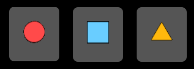

% Progress Indicators

## moonstone/ProgressBar

[moonstone/ProgressBar]($api/#/kind/moonstone/ProgressBar/ProgressBar) is a
control that shows the current progress of a process in a horizontal bar.  By
default, the `progress` property tracks the process's completion percentage as a
number between `0` and `100`.

To animate progress changes, call the `animateProgressTo()` method, passing in
the destination `progress` value.

```javascript
    var
        kind = require('enyo/kind'),
        ProgressBar = require('moonstone/ProgressBar');

    {kind: ProgressBar, progress: 25}
```


In addition to the main process, the ProgressBar can track the state of a
background process via the `bgProgress` property.

```javascript
    var
        kind = require('enyo/kind'),
        ProgressBar = require('moonstone/ProgressBar');

    {kind: ProgressBar, progress: 25, bgProgress: 75}
```


## moonstone/Slider

[moonstone/Slider]($api/#/kind/moonstone/Slider/Slider) extends
`moonstone/ProgressBar`, presenting a range of selection options in the form of
a horizontal slider with a control knob.  The knob may be tapped and dragged to
the desired location.

```javascript
    var
        kind = require('enyo/kind'),
        Slider = require('moonstone/Slider');

    {kind: Slider, value: 30}
```


`onChanging` events are fired while the control knob is being dragged, and an
`onChange` event is fired when the position is set, either by finishing a drag
or by tapping the bar.


## moonstone/Spinner

[moonstone/Spinner]($api/#/kind/moonstone/Spinner/Spinner) is a control used to
indicate that an activity is in progress.  It is typically hidden when the
activity ends.

The spinner has a looping animation that starts automatically when the control
is shown; the animation may also be controlled programmatically via the
`start()`, `stop()`, and `toggle()` methods.


