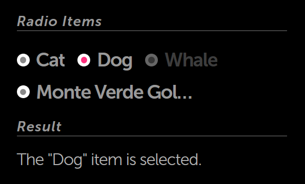

% Radio Items (Radio Buttons)

## moonstone/RadioItem

[moonstone/RadioItem]($api/#/kind/moonstone/RadioItem/RadioItem) is a
[moonstone/Button]($api/#/kind/moonstone/Button/Button) designed to go inside a
[moonstone/RadioItemGroup]($api/#/kind/moonstone/RadioItemGroup/RadioItemGroup),
a horizontally-oriented group of items in which tapping on one item will release
any previously-tapped items.

Let's look at how a radio item group works.

```javascript
    var
        kind = require('enyo/kind'),
        FittableRows = require('layout/FittableRows'),
        BodyText = require('moonstone/BodyText'),
        Divider = require('moonstone/Divider'),
        RadioItem = require('moonstone/RadioItem'),
        RadioItemGroup = require('moonstone/RadioItemGroup');

    module.exports = kind({
        name: 'RadioItemSample',
        classes: 'moon enyo-unselectable enyo-fit',
        kind: FittableRows,
        components: [
            {fit: true, components: [
                {kind: Divider, content: 'Radio Items'},
                {kind: RadioItemGroup, onActivate: 'buttonActivated', components: [
                    {content: 'Cat'},
                    {content: 'Dog'},
                    {content: 'Whale', disabled: true},
                    {content: 'Monte Verde Golden Toad'}
                ]}
            ]},
            {kind: Divider, content: 'Result'},
            {kind: BodyText, name: 'result', content: "No action yet."}
        ],
        rendered: function () {
            this.inherited(arguments);
        },
        buttonActivated: function (sender, ev) {
            var originator = ev.originator,
            str = 'The "';

            if (!originator || !this.hasNode()) {
                return;
            }

            str += (ev.originator.getActive() && ev.originator instanceof RadioItem)
                ? originator.getContent() : originator.name;
            str +=  '" item is selected.';

            this.$.result.setContent(str);
        }
    });
```


Notice that we have one handler method for the entire group.  When an item is
tapped (or "activated"), we are able to identify the source of the event using
`ev.originator`.  So if we tap "Dog", we see the following:



Also note that we don't have to explicitly declare the kind for our radio items.
When a new control is added to a `moonstone/RadioItemGroup`, its kind defaults
to `moonstone/RadioItem`.  (You can change this behavior by explicitly setting the
`defaultKind` property of the radio group.)
