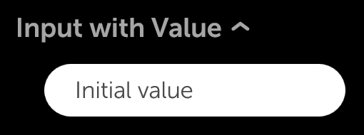
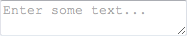
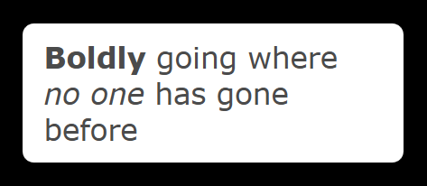

% Text Fields

The Enyo framework provides a variety of controls designed to facilitate the
display and manipulation of text.

## enyo/Input

[enyo/Input]($api/#/kind/enyo/Input/Input) is an [enyo/Control]($api/#/kind/enyo/Control/Control)
that implements an HTML `<input>` element with cross-platform support for change
events.

You can listen for the `oninput` and `onchange` DOM events to know when the text
inside an Input has been modified.  `oninput` fires immediately, while
`onchange` fires when the text has changed and the input loses focus.

```javascript
    var
        kind = require('enyo/kind'),
        Input = require('enyo/Input');

    components: [
        {kind: Input, name: 'myInput', placeholder: 'Enter some text...',
            oninput: 'inputChanged'}
    ],
    inputChanged: function (sender, ev) {
        // retrieve new input value
        newInputValue = this.$.myInput.get('value');
        // do something in response
    }
```


As illustrated above, you may use the `placeholder` property to specify text to
be displayed when the input is empty.

Also, in the event handler method, you may access the value of the input by
calling `get('value')` (or `set('value', <new value>)`).

To create an input suitable for password entry, set the `type` property to
`'password'`.

Finally, two other properties of `enyo/Input` deserve mention.  By setting the
`disabled` property to `true`, you can prevent the user from entering anything
into the input (presumably on a temporary basis).  And by setting `defaultFocus`
to `true`, you can make the input take focus when rendered.  (Note that you
should only do this for one input.)

## moonstone/Input

[moonstone/Input]($api/#/kind/moonstone/Input/Input) derives from `enyo/Input`
and provides the same functionality with added visual styling.

Typically, a `moonstone/Input` is placed inside a
[moonstone/InputDecorator]($api/#/kind/moonstone/InputDecorator/InputDecorator),
e.g.:

```javascript
    var
        kind = require('enyo/kind'),
        Input = require('moonstone/Input'),
        InputDecorator = require('moonstone/InputDecorator');

    {kind: InputDecorator, components: [
        {kind: Input, type: 'password', placeholder: 'Enter password',
            oninput: 'inputChanged'}
    ]}
```


## moonstone/ExpandableInput

[moonstone/ExpandableInput]($api/#/kind/moonstone/ExpandableInput/ExpandableInput)
is a [moonstone/ExpandableListItem]($api/#/kind/moonstone/ExpandableListItem/ExpandableListItem)
that contains a `moonstone/Input` within its drop-down content area.

In its collapsed state, the ExpandableInput displays its `content` and `value`.
In the expanded state, the text input appears, giving the user the opportunity
to change the `value`.

```javascript
    var
        kind = require('enyo/kind'),
        ExpandableInput = require('moonstone/ExpandableInput');

    {kind: ExpandableInput, oninput: 'inputChanging', onChange: 'inputChanged',
        content: 'Input with Value', value: 'Initial value'}
```




## enyo/TextArea

[enyo/TextArea]($api/#/kind/enyo/TextArea/TextArea) is an `enyo/Input` that
implements an HTML `<textarea>` element with cross-platform support for change
events.

`enyo/TextArea` is functionally equivalent to `enyo/Input`; one interacts with
it through the same events (`oninput`, `onchange`) and properties (`value`,
`placeholder`, `type`, `disabled`, `defaultFocus`).

A TextArea differs from an Input mainly in that the text field it displays spans
multiple lines.

```javascript
    var
        kind = require('enyo/kind'),
        TextArea = require('enyo/TextArea');

    {kind: TextArea, placeholder: 'Enter some text...', oninput: 'inputChanged'}
```



## moonstone/TextArea

[moonstone/TextArea]($api/#/kind/moonstone/TextArea/TextArea) is a
Moonstone-styled TextArea control, derived from `enyo/TextArea`.  Typically, a
`moonstone/TextArea` is placed inside a `moonstone/InputDecorator`, which
provides styling, e.g.:

```javascript
    var
        kind = require('enyo/kind'),
        InputDecorator = require('moonstone/InputDecorator'),
        TextArea = require('moonstone/TextArea');

    {kind: InputDecorator, components: [
        {kind: TextArea, oninput: 'inputChanged'}
    ]}
```


## enyo/RichText

[enyo/RichText]($api/#/kind/enyo/RichText/RichText) is a multi-line `enyo/Input`
that supports rich formatting, such as bold, italics, and underlining.

```javascript
    var
        kind = require('enyo/kind'),
        RichText = require('enyo/RichText');

    {kind: RichText,
        value: '<b>Boldly</b> going where <i>no one</i> has gone before',
        style: 'width: 250px;', defaultFocus: true, oninput: 'inputChanged'}
```


As with Input and TextArea, the text displayed in a RichText may be accessed at
runtime via `get('value')` and `set('value', <new value>)`.

RichText also has `disabled` and `defaultFocus` properties that function just
like their counterparts in Input and TextArea.

`enyo/RichText` differs from Input and TextArea in having an `allowHtml`
property.  This is `true` by default, enabling HTML-based rich formatting.  Note
that the default setting allows *any* HTML to be inserted into the RichText,
including `<iframe>` and `<script>` tags.  Since this can be a security concern
in some situations, you have the option of setting `allowHtml` to `false`, in
which case any inserted HTML will be escaped.

RichText also differs from Input and TextArea by offering methods for
manipulating the current selection and the cursor position.  The selection
operations and `insertAtCursor()` method use the [HTML Editing
APIs](https://dvcs.w3.org/hg/editing/raw-file/tip/editing.html#selections).

In addition, RichText requires explicit sizing for width.

Note that RichText is not supported on Android < 3.

## moonstone/RichText

[moonstone/RichText]($api/#/kind/moonstone/RichText/RichText) is a multi-line
text input that supports rich formatting, such as bold, italics, and
underlining.  It is derived directly from `enyo/RichText`.

The content displayed in a RichText may be accessed at runtime via the `value`
property.

```javascript
    var
        kind = require('enyo/kind'),
        InputDecorator = require('moonstone/InputDecorator'),
        RichText = require('moonstone/RichText');

    {kind: InputDecorator, components: [
        {kind: RichText, oninput: 'handleInput', onchange: 'handleChange',
            value: '<b>Boldly</b> going where <i>no one</i> has gone before'}
    ]}
```



## moonstone/ExpandableText

Finally, [moonstone/ExpandableText]($api/#/kind/moonstone/ExpandableText/ExpandableText)
is an [enyo/Control]($api/#/kind/enyo/Control/Control) that allows long bodies
of text to be shown or hidden.

```javascript
    var
        kind = require('enyo/kind'),
        ExpandableText = require('moonstone/ExpandableText');

    {kind: ExpandableText, collapsed: true, maxLines: 3,
        content: 'I left my heart in San Francisco.'}
```

The current state of the ExpandableText is determined by the Boolean value of
its `collapsed` property.  If `false`, the ExpandableText is expanded (i.e., its
content is visible); if `true` (the default), the ExpandableText is collapsed
(i.e., its content is not visible).

ExpandableText works in conjunction with
[moonstone/ExpandableText/ExpandableTextButton]($api/#/kind/moonstone/ExpandableText/ExpandableTextButton).
When an ExpandableTextButton is activated, the `collapsed` value of the
associated ExpandableText is toggled and an `onExpandCollapse` event is fired.

Note that the content of an ExpandableText is not meant to be user-editable.
