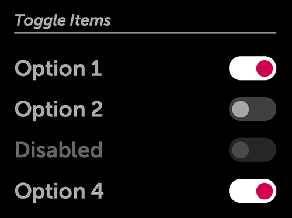

% Toggles

## moonstone/ToggleText

[moonstone/ToggleText]($api/#/kind/moonstone/ToggleText/ToggleText), a control
that inherits from [moonstone/Checkbox]($api/#/kind/moonstone/Checkbox/Checkbox),
looks like a switch with labels for two states.  Each time it is tapped, it
switches its state and fires an `onChange` event.

```javascript
    var
        kind = require('enyo/kind'),
        ToggleText = require('moonstone/ToggleText');

    {kind: ToggleText, onContent: 'foo', offContent: 'bar',
        onChange: 'toggleTextToggle'},

    ...

    toggleTextToggle: function (sender, ev) {
        this.log('Toggled to value ' + ev.value);
    }
```

You may customize the appearance of the control's "on" state by setting the
background color as a CSS style:

```javascript
    var
        kind = require('enyo/kind'),
        ToggleText = require('moonstone/ToggleText');

    {kind: ToggleText, style: 'background-color: #35A8EE;'}
```

Finally, you may determine whether the toggle is currently "on" by querying its
`value` property.  The returned value will be a Boolean `true` or `false`:

```javascript
    queryToggleValue: function () {
        return this.$.toggleText.get('value');
    }
```

## moonstone/ToggleSwitch

[moonstone/ToggleSwitch]($api/#/kind/moonstone/ToggleSwitch/ToggleSwitch), which
also inherits from `moonstone/Checkbox`, is a control that looks like a switch
with an "on" state and an "off" state.  When the ToggleSwitch is tapped, it
switches its state and fires an `onChange` event.

`moonstone/ToggleSwitch` differs from `moonstone/ToggleText` mainly in that the
"on" and "off" states are represented visually instead of textually.  (For a
look at ToggleSwitch controls in various states, see the illustration for
`moonstone/ToggleItem` below.)

## moonstone/ToggleItem

[moonstone/ToggleItem]($api/#/kind/moonstone/ToggleItem/ToggleItem) derives from
[moonstone/CheckboxItem]($api/#/kind/moonstone/CheckboxItem/CheckboxItem) and
provides a convenient way to combine a ToggleSwitch with a text label.

```javascript
    var
        kind = require('enyo/kind'),
        Divider = require('moonstone/Divider'),
        ToggleItem = require('moonstone/ToggleItem');

    components: [
        {kind: Divider, content: 'Toggle Items'},
        {kind: ToggleItem, content: 'Option 1', checked: true,
            onchange: 'itemChanged'},
        {kind: ToggleItem, content: 'Option 2', onchange: 'itemChanged'},
        {kind: ToggleItem, disabled: true, content: 'Disabled',
            onchange: 'itemChanged'},
        {kind: ToggleItem, content: 'Option 4', checked: true,
            onchange: 'itemChanged'}
    ]
```



Toggle items may be used with Enyo's group API.  You may specify multiple toggle
items as components within an [enyo/Group]($api/#/kind/enyo/Group/Group) to
create a control in which only one of the items may be in the "on" state (i.e.,
`checked: true`) at a given time.

## moonstone/ToggleButton

[moonstone/ToggleButton]($api/#/kind/moonstone/ToggleButton/ToggleButton), which
extends [moonstone/Button]($api/#/kind/moonstone/Button/Button), is a button
with two states ("on" and "off"), each of which has an associated text label.
When the button is tapped, the state switches (as evidenced by updates to the
text label and visual styling), and an `onChange` event is fired.

```javascript
    var
        kind = require('enyo/kind'),
        ToggleButton = require('moonstone/ToggleButton');

    {kind: ToggleButton, toggleOnLabel: 'wifi is on',
        toggleOffLabel: 'wifi is off', ontap: 'buttonTapped'}
```


