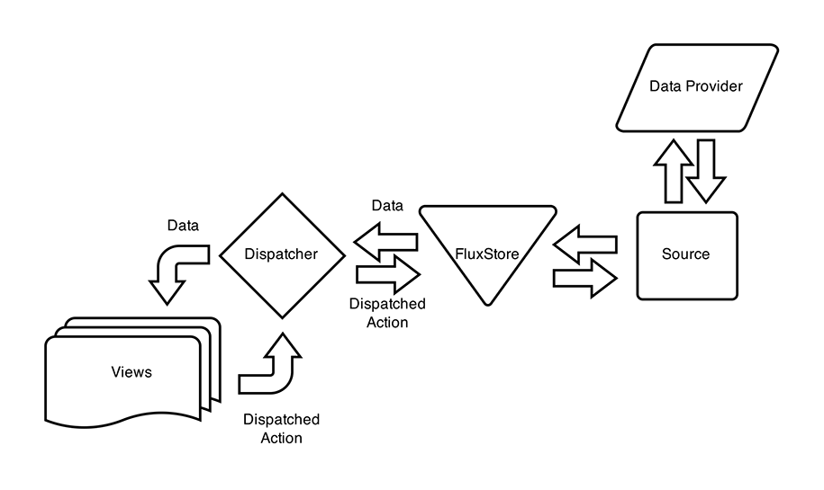
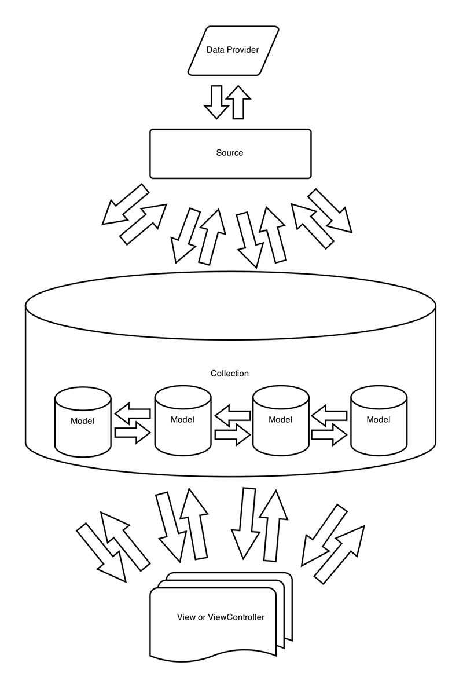

# Flux in Enyo

One of the new features included in Enyo 2.6 is support for the Flux application
architecture.  In this article, we look what Flux is, what it does, and how to
use it in your Enyo application.

**Please note that the code samples in this document are currently based on the
Enyo framework's pre-2.6 (i.e., pre-modularized) state.  We will update the code
for compatibility with modularized Enyo in the near future.**

## What is Flux?

Flux is the process of flowing. In terms of application structure, it is a
process of unidirectional data flow.  When an app uses the Flux pattern, the
one-way flow of data allows the view layer to be an immutable data structure for
consumption.

## What problem does Flux address?

As the number of models in an application increases and the relationships
between models multiply, the different modules in the app may get out of sync
regarding the state of the data.  To address this issue, we have borrowed
[Facebook's Flux implementation](https://facebook.github.io/flux/docs/overview.html)
and brought it into Enyo core.

Of course, Flux has other benefits beyond the elimination of data artifacts.
For example, in a browser environment, a simplified process for delivering data
to the UI can translate to faster rendering of that data.

In a traditional Model-View-Controller JavaScript environment, observer
mechanisms monitor the data for changes and maintain the data's notification
relationships.  As the application and the data increase in complexity, so, too,
can the observer scheme.  Flux provides a way to minimize this complexity.

## What does Flux look like?

The following graphic shows the data flow in a sample Flux application.
Data consumers ask the dispatcher to pass `Action` requests (with payloads) to
the data store.  The payload may contain any meaningful data that a store needs
to operate.



## How is this different from Enyo MVC?



## What are the downsides?

One of the central features of Flux is also one of its biggest potential
downsides--the fact that, when a store's data changes, all consumers of the
store's data are notified, even those whose underlying data has not changed.

In the React world, this works relatively well thanks to the differing mechanism
used to build the DOM.  As it turns out, this also works well in Enyo because we
do not re-render components that are currently on drawn on the DOM.

## Using Flux with Enyo

The Enyo framework's Flux support comes in the form of two new components,
`enyo/FluxDispatcher`, and `enyo/FluxStore`.

FluxDispatcher is a singleton instance whose job is to usher data and route
action requests across multiple stores and consumers.

FluxStore is an extendable traditional Enyo component.  Each FluxStore should be
modified to handle its unique requirements for data retrieval and modification.

When multiple coordinated FluxStores are needed, implement a Controller as a
consumer of payload dispatches, to route multiple actions across stores.

### Our First Store

To create our first store, we will extend `enyo/FluxStore` and define our Action
handler inside of the `update()` method.  We will also set the `source` property
to an instance of `enyo/Source` to be consumed.

```javascript
    var
        kind = require('enyo/kind'),
        FluxStore = require('enyo/FluxStore'),
        Source = require(enyo.Source);

    kind({
        name: 'myapp.MyFluxStore',
        kind: FluxStore,
        source: Source,
        update: function(actions) {
            //handle actions dispatched to the store
        }
    });
```

When a store instance is created, it will notify the dispatcher.  In this case,
we have departed from the general Flux pattern.  An `enyo/FluxStore` will be
assigned a dispatch id when created.  We'll use this dispatch id to reduce the
length of the potential notification stack.

Here's an example showing the FluxStore being created inside an application:

```javascript
    var
        kind = require('enyo/kind'),
        App = require('enyo/Application');

    kind({
        name: 'myapp.Application',
        kind: App,
        create: function() {

            this.inherited(arguments);
            //create a new instance of the FluxStore
            this.store = new myapp.MyFluxStore();
        }
    });
```

### Defining Actions

Of course, the `update()` method is not going to do us any good unless we define
a set of actions that the FluxStore and a consumer will share.  To do this, we
create a singleton of static constants.

```javascript
    var kind = require('enyo/kind');

    kind.singleton({
        name: 'myapp.Constants.Actions',
        myAction: 'myAction'
    });
```

This structure will allow the dynamic parts of our application, the Dispatcher
and View, to communicate needed actions back to the FluxStore.

### Creating a View

The Flux pattern requires a slight modification of the way you manage the view
and its consumption of the data driving the interface.

```javascript
    var
        kind = require('enyo/kind'),
        utils = require('enyo/utils'),
        FluxDispatcher = require('enyo/FluxDispatcher');

    kind({
        name: 'myapp.MyView',
        create: function() {

            this.inherited(arguments);
            this.subscriptionID = FluxDispatcher.subscribe(
                    this.app.store.id, //the store provides this ID
                    utils.bind(this, this.update)
            );
        },
        update: function(payload) {

            //interact with the fetched data here
            if(payload.fooNode) {

                this.$.SomeControl.set('content', payload.fooNode.foo);
            }
        }
    });
```

The view is subscribed to the FluxStore via its dispatch ID.  The `update()`
method is provided as the callback to the dispatcher.  When the specific store's
notification is invoked, the `update()` method will be passed the entire data
set.

Because each consumer's `update()` method will be invoked, we must be sure to
guard against evaluations that we do not want to take place.  Without the proper
guard code, you will likely encounter numerous `property of undefined` errors.

### Sending Actions to a Store

Now that we have a pattern for bringing the data from the FluxStore to the View,
how will we get the View to send updates back to the FluxStore?

We'll utilize the FluxDispatcher and the actions we previously defined.  Let's
suppose that our view contains a button; when the button is clicked, we use the
`ontap` event to invoke a method called `tapHandler()`.

```javascript
    tapHandler: function(sender, ev) {
        //notify the store an action took place
        //pass it the data needed to modify data
        FluxDispatcher.notify(
            this.app.store.id,
            {
                actionType: myapp.Constants.Actions.myAction,
                payload: {
                    'bar'
                }
            }
        );
    }
```

The dispatcher passes this as a payload to the FluxStore.  The store's
`update()` method is invoked, and we determine how to handle the data based on
the passed-in action.

```javascript
    var
        kind = require('enyo/kind'),
        FluxStore = require(enyo/FluxStore),
        Source = require('enyo/Source');

    kind({
        name: 'myapp.MyFluxStore',
        kind: FluxStore,
        source: Source,
        update: function(action) {

            //handle dispatched actions to the store
            switch(action.actionType) {

                case myapp.Constants.Actions.myAction:

                    this.handleMyAction(action.payload);
                    break;
                default:
                    //default code block
            }
        },
        handleMyAction: function(data) {
            //do something here with your source
        }
    });
```

### Interacting with Multiple Stores

What if you need to implement an action against more than one store?  In this
case, we can create a Controller that listens for notifications.  The Controller
may either listen to an existing notification stack or create its own stack.

```javascript
    var
        kind = require('enyo/kind'),
        FluxDispatcher = require('enyo/FluxDispatcher'),
        Controller = require('enyo/Controller');

    kind({
        name: 'myapp.ActionController',
        kind: Controller,
        create: function() {
            this.inherited(arguments);
            this.subscriptionID = FluxDispatcher.subscribe(
                    this.app.storeA.id, //the store provides this ID
                    this.bind(this, this.update)
            );
        },
        update: function(action) {

            switch(action.actionType) {

                case myapp.Constants.Actions.myCompoundAction:

                    FluxDispatcher.notify(
                         this.app.storeA.id,
                         myapp.Constants.Actions.myAction,
                         action.payload);

                    FluxDispatcher.notify(
                         this.app.storeB.id,
                         myapp.Constants.Actions.myAction,
                         action.payload);

                    break;

                default:
                    //default code block
            }
        }
    });
```

Our ActionController will listen the `storeA` stack for notifications.  When a
`CompoundAction` is sent, the ActionController will dispatch `Actions` to the
appropriate stores.

### Working with Dependent Stores

In instances where a compound action may take place, you may have a need to
interact with multiple stores, based on dependency.

In such a situation, a store may use the `waitFor()` method provided by
`enyo/FluxDispatcher`.  This method is invoked inside a dispatching method like
`update()`.  When `waitFor()` is used, the independent store's `update()` method
will complete before the dependent method is invoked.

```javascript
    var
        kind = require('enyo/kind'),
        Source = require('enyo/Source'),
        FluxDispatcher = require('enyo/FluxDispatcher'),
        FluxStore = require('enyo/FluxStore');

    kind({
        name: 'myapp.StoreB',
        kind: FluxStore,
        source: Source,
        update: function(actions) {

            FluxDispatcher.waitFor(this.app.storeA.id,
            function(){
                //complete the action here after storeA.update
                }
            )}
        });
```

## Summary

The Flux pattern is an improved approach for dealing with complex relational data.

The flow of data from the Control layer to the View layer is streamlined through
the use of a wider Model.

All data handling is funneled to, and all handling methods are encapsulated in,
the FluxStore.  The store is responsible for holding the data, modifying the
data, and interacting with the source of the data.

If we need to interact with multiple FluxStore instances, we can use an
`Controller` that is configured to consume `Compound Action` notifications
from the FluxDispatcher, and to dispatch `Actions` through the FluxDispatcher to
the appropriate stores.

If we know that one FluxStore is dependent on another FluxStore, we can use
`FluxDispatcher.waitFor()` inside the store's `update()` method to ensure
that the independent store completes its update first.
