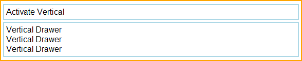
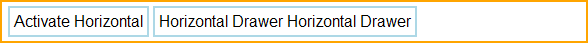

% Drawers

## enyo.Drawer

(Note: In Enyo 2.3, the Drawer kind was moved from the Onyx library into Enyo
core.  `onyx.Drawer` continues to exist, but is now simply an alias to
`enyo.Drawer`.)

[enyo.Drawer]($api/#/kind/enyo.Drawer) is a control that appears or disappears
based on its `open` property.  `open` is a Boolean that defaults to `true`,
meaning that the control is visible.

By default, a Drawer appears or disappears with a sliding animation whose
direction is determined by the `orient` property.  The default value of `orient`
is `'v'`, indicating that the drawer opens and closes along the vertical axis.
To create a horizontally-oriented drawer, set `orient` to `'h'`.

`enyo.Drawer` exposes an `animated` property, which may be set to `false` to
disable the sliding animation.

### Vertical Drawers

Here's a kind that implements a simple vertically-oriented drawer:

```javascript
    enyo.kind({
        name: "VDrawer",
        components: [
            {kind: "FittableRows", classes: "outer-box", components: [
                {content: "Activate Vertical", classes: "inner-box inner-box-v", ontap: "activateDrawer"},
                {name: "drawer", kind: "enyo.Drawer", open: false, components: [
                    {content: "Vertical Drawer<br>Vertical Drawer</br>Vertical Drawer",
                        classes: "inner-box inner-box-v", allowHtml: true}
                ]}
            ]}
        ],
        activateDrawer: function(inSender, inEvent) {
            this.$.drawer.setOpen(!this.$.drawer.open);
        },
    });
```

Because we've set `"open: false"` on the drawer, it starts out in the closed
state when this view is loaded.


Then, when the `"Activate Vertical"` box is tapped, the `activateDrawer()`
method toggles the `open` state (and visibility).



(For details on the CSS classes used in this example, see "A Note on CSS" below.)

### Horizontal Drawers

The following kind implements a simple horizontally-oriented drawer:

```javascript
    enyo.kind({
        name: "HDrawer",
        components: [
            {kind: "FittableColumns", ontap: "activateColumnsDrawer", classes: "outer-box",
                components: [
                    {content: "Activate Horizontal", classes: "inner-box inner-box-h"},
                    {name: "columnsDrawer", orient: "h", kind: "enyo.Drawer", fit: true, open: false,
                        components: [
                            {content: "Horizontal Drawer Horizontal Drawer",
                                classes: "inner-box inner-box-h"}
                        ]
                    }
                ]
            }
        ],
        activateColumnsDrawer: function(inSender, inEvent) {
            this.$.columnsDrawer.setOpen(!this.$.columnsDrawer.open);
        }
    });
```

As in the previous example, we've set `"open: false"`, so the drawer first
appears in its closed state.


A subsequent tap on the activation box toggles the `open` state to `true` (i.e.,
visible).


Note that `"fit: true"` is set on the drawer control.  This causes the drawer to
expand horizontally--beyond the natural width of its content--to fill the
available space in the container.  If we do not set `"fit: true"`, the drawer
assumes the natural width of its content:



### A Note on CSS

The examples in this document make use of the following CSS styles:

```css
    .outer-box {
        border: 2px solid orange;
        padding: 4px;
        white-space: nowrap;
        overflow: hidden;
        margin-top: 3px;
        margin-bottom: 3px;
    }

    .inner-box {
        border: 2px solid lightblue;
        padding: 4px;
        white-space: nowrap;
        overflow: hidden;
    }

    .inner-box-v {
        margin-top: 2px;
        margin-bottom: 2px;
    }

    .inner-box-h {
        margin-left: 2px;
        margin-right: 2px;
    }
```

Note that there are slight differences in how margins are handled, depending on
the orientation of the drawer.

## moon.Drawer and moon.Drawers

The Moonstone library has its own implementation of drawer functionality, based
on [moon.Drawer]($api/#/kind/moon.Drawer) (which is **not** a subkind of
`enyo.Drawer`) and [moon.Drawers]($api/#/kind/moon.Drawers) (which is a
container for `moon.Drawer` objects).

`moon.Drawer` contains two areas for content--a main content area, where items
declared in the `components` block live, and an optional `controlDrawer`, which
houses any items declared in a `controlDrawerComponents` block.  In addition, in
its `handle` property, `moon.Drawer` allows you to specify an activator control,
which is displayed along with a styled label.

`moon.Drawer` objects are designed to be placed inside a `moon.Drawers`
container.  This is done by supplying an array of Drawer objects in the
`drawers` property of the `moon.Drawers`.  The drawer handles are grouped
together visually in the Drawers control; selecting a handle will activate the
associated drawer, opening either the main content area or the control drawer
(depending on how the Drawer is configured).

Finally, note that a `moon.Drawers` may contain child components of any kind.


