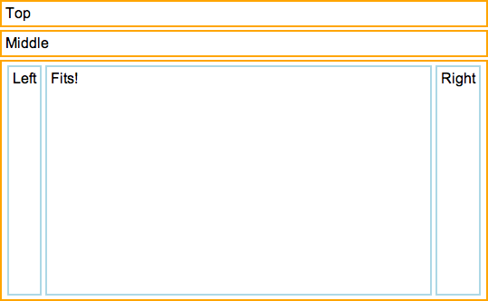

% Fittables

The fittable package helps you create layouts that expand to fit the available
space--a common need for apps, but one that has historically been difficult to
meet using Web technologies.

## FittableColumns and FittableRows

The [FittableColumns]($api/#/kind/layout/FittableColumns/FittableColumns) and
[FittableRows]($api/#/kind/layout/FittableRows/FittableRows) controls let you
define views whose children are arranged either horizontally or vertically.
Within a given view, you may designate one child to expand and contract to fit
the available space, while its siblings retain their natural or
explicitly-specified sizes.

To mark a child control as the one having variable size, set its `fit` property
to `true`, e.g.:

```javascript
    var
        kind = require('enyo/kind'),
        FittableColumns = require('layout/FittableColumns');

    module.exports = kind({
        kind: FittableColumns,
        components: [
            {content: '1'},
            {content: '2', fit: true},
            {content: '3'}
        ]
    });
```

The preceding code aligns three components as columns, with the second filling
the available container space between the first and third.

## FittableColumnsLayout and FittableRowsLayout

Another way to use the fittable layout strategy is to set a kind's `layoutKind`
property to "[FittableColumnsLayout]($api/#/kind/layout/FittableLayout/FittableColumnsLayout)"
or "[FittableRowsLayout]($api/#/kind/layout/FittableLayout/FittableRowsLayout)"
while employing a different base kind:

```javascript
    var
        kind = require('enyo/kind'),
        Control = require('enyo/Control'),
        FittableLayout = require('layout/FittableLayout'),
        FittableColumnsLayout = FittableLayout.Columns;

    module.exports = kind({
        kind: Control,
        layoutKind: FittableColumnsLayout,
        components: [
            {content: '1'},
            {content: '2', fit: true},
            {content: '3'}
        ]
    });
```

Both `FittableColumnsLayout` and `FittableRowsLayout` are derived directly from
[layout/FittableLayout]($api/#/kind/layout/FittableLayout/FittableLayout), which provides basic
positioning and boundary logic.

## Nested Fittables

Fittable views may be nested as needed, as illustrated by the following example,
in which we've nested a FittableColumns control inside of a FittableRows:

```javascript
        kind = require('enyo/kind'),
        FittableColumns = require('layout/FittableColumns'),
        FittableRows = require('layout/FittableRows');

    module.exports = kind({
        name: 'NestedFittablesExample',
        kind: FittableRows,
        components: [
            {content: 'Top', allowHtml: true, classes: 'outer-box'},
            {content: 'Middle', allowHtml: true, classes: 'outer-box'},
            {kind: FittableColumns, fit: true, classes: 'outer-box', components: [
                {content: 'Left', classes: 'inner-box'},
                {content: 'Fits!', fit: true, classes: 'inner-box'},
                {content: 'Right', classes: 'inner-box'}
            ]}
        ]
    });
```



For the sake of completeness, here's the CSS that was used:

```css
    .outer-box {
        border: 2px solid orange;
        padding: 4px;
        white-space: nowrap;
        overflow: hidden;
        margin-top: 3px;
        margin-bottom: 3px;
    }

    .inner-box {
        border: 2px solid lightblue;
        padding: 4px;
        white-space: nowrap;
        overflow: hidden;
        margin: 2px;
    }
```

## Resizing Fittables

One important thing to keep in mind when using Fittables (or any layout kind,
for that matter) is that layout code runs once, when a view is initially
rendered; after rendering is complete, layout code is only re-run in response to
window resize events.  If any asynchronous events change the size of a
Fittable's children, it is the developer's responsibility to call `resized()` on
the Fittable, which will cause a recursive reflow of all the layouts the
Fittable contains.

## Parting Thoughts

If you think that fittables sound a lot like a limited version of the CSS
Flexible Box Model, you're right.  Our main objective in creating fittables was
to provide a layout model with capabilities like those of Flex Box, but with
compatibility across a broader range of browsers.  We also wanted to impose as
few limitations as possible on the CSS styling of child components, and to use
JavaScript sparingly (we use it to calculate the height of fittable elements,
but otherwise leave the layout work to the browser).

As much as we like them, we want to emphasize that you should only use
fittables when you need views to expand and contract to fit the available space.
If you simply want to arrange elements horizontally or vertically, you're better
off employing standard Web layout techniques. 

Check the Layout section of the [Sampler app](http://enyojs.com/sampler/) for
more examples of fittable layouts in action.
