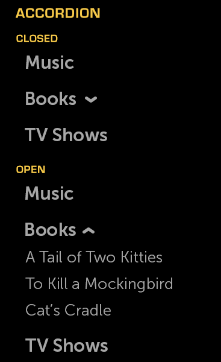

% Accordion

## About

An Accordion is an item that can contain "child" items.  It has an icon to the
right of the header, indicating whether the accordion is currently open or
closed.  When open, the children are visible; when closed, the children are
hidden.

An accordion must contain a minimum of two items.

## API Reference

[moonstone/Accordion]($api/#/kind/moonstone/Accordion)

## Behaviors and States

### Behavior

The closed state is signified by an upward-pointing arrow to the right of the
header.  When the Accordion is open, the arrow is pointed downward.

A user may toggle the Accordion's open/closed state by selecting one of the text
headers while the Accordion is in the focused state.  The default state is
closed.

List items within an Accordion are selectable.  Since multiselection is
possible, the Accordion should not automatically close after an item is
selected.

### Grouping

When Accordions are placed in a group, only one Accordion in the group may be
open at a time.

### States

An Accordion may be either open or closed.  Toggle between the two states by
selecting one of the text headers while the Accordion has focus.

### Sizing

The height of an Accordion is dependent on the number of items it contains.  The
width of the Accordion is determined by its parent container.  The width may
also be fixed, causing longer text to be truncatated with an ellipsis.  When
focused, the ellipsized text will marquee.

### Illustration

