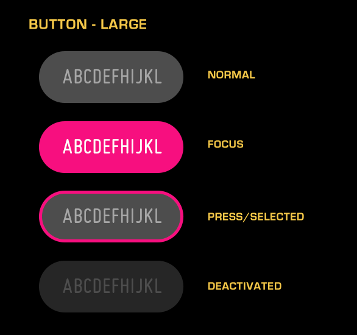
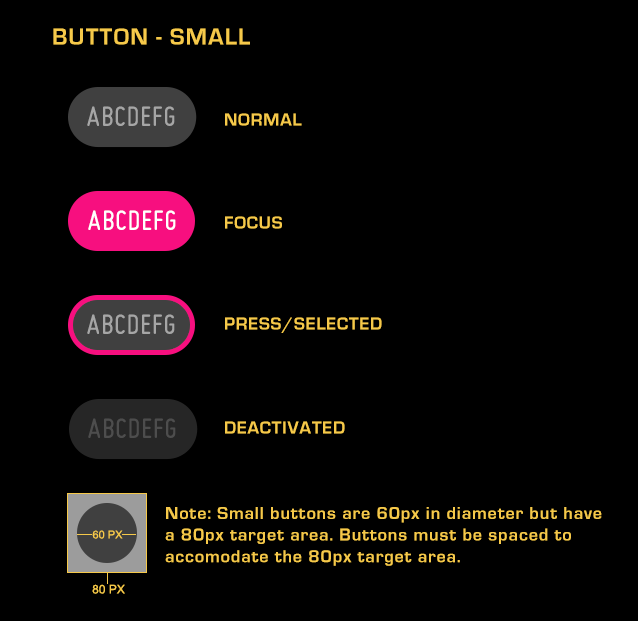
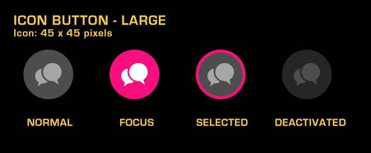
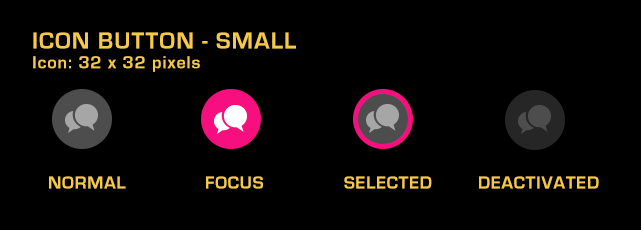
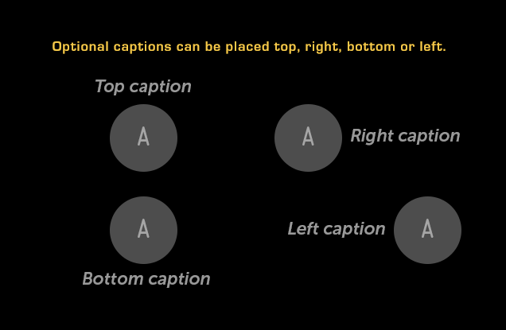
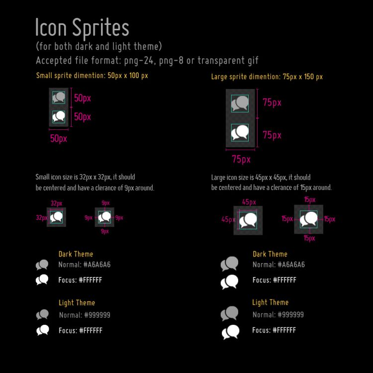

% Button

## About

A Button is a control that invokes an action when pressed.  Buttons come in two
basic types, text and icon, and are available in two sizes, large and small.

## API Reference

[moonstone/Button]($api/#/kind/moonstone/Button)

## Behaviors and States

### Behavior

Icon buttons are great for minimalist designs, but only if the user is able to
understand the icons' meaning.  Icon buttons may have an optional caption, which
can help describe the function of the button.  The caption may be placed at the
top, bottom, left, or right side of the icon button. 

Buttons are available in two sizes: large and small.  The large button should be
used sparingly (and for primary actions) because of its attention-grabbing
nature.  The small button is used for all other actions; multiple instances may
be used without overwhelming the user.  The small-sized button is the button
used in panel headers.

Toggle buttons have are able to reflect an on/off state.  The selected state
indicates that an option is "on", while the unselected (default) state is "off".

Focusing and then pressing a button will result in either the execution of an
action or the toggling of state (when the button is released).

### States

A Button will be in one of four states at any given time:

* **Normal (up/unpressed)**

    There has been no interaction with the button, but it is available for use.

* **Focused (hover)**

    The button is being hovered over, or has the focus from 5-way navigation.
    This state may be animated.

* **Selected (down/pressed)**

    The button is not focused, but has previously been activated, triggering a
    state-changing action.  An example would be a toggle button in the "on"
    state.

* **Deactivated (disabled)**

    The user cannot use the button.

### Sizing

#### Large Button and Small Button

For text buttons, the width of the button will automatically scale to fit the
text.  Note, however, that there is both a minimum width (130px for small
button; 180px for large button) and a maximum width (300px).  Alternatively,
buttons may be set to a fixed width, if you so desire.

When text exceeds the button width (either the fixed size or the maximum), the
text be truncated and ellipsized.  When the button is in the focused state, the
text will marquee to show the full string.

Large buttons should be used sparingly, and for primary actions, as they are
attention-grabbing.  The small button is preferred for most actions.  Only small
buttons should be used inside panel headers.

#### Icon Button

Icon buttons are a fixed size; images should be sized appropriately to ensure
that they are not clipped.  In a large button, the icon area is 45px x 45px; in a
small button, it is 32px x 32px.

### Illustration

#### Large Button (85 pixels high, variable width)

#### Small Button (60 pixels high with 80-pixel target area, variable width)

#### Large Icon Button (85 pixels high)

#### Small Icon Button (60 pixels high with 80-pixel target area)

#### Optional Captions

#### Icon Sprite Specifications

