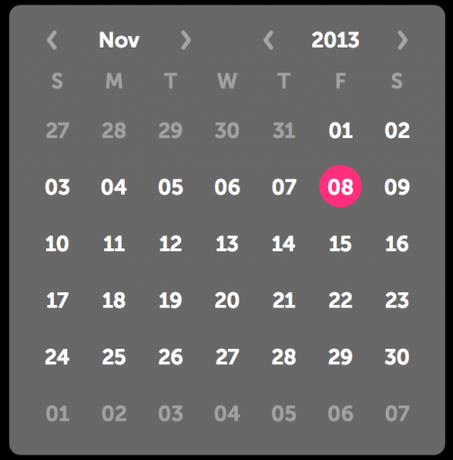

% Calendar

## About

Calendar may be used to select dates from a month-based calendar.

## API Reference

[moonstone/Calendar]($api/#/kind/moonstone/Calendar)

## Behavior and States

### Behavior

A Calendar is a popup window that allows users to select dates from a monthly
calendar.  The user may change the month and year using the simple pickers at
the top of the popup.  When a date is selected, the Calendar popup closes and
the action button updates with the chosen date.

## Illustration

