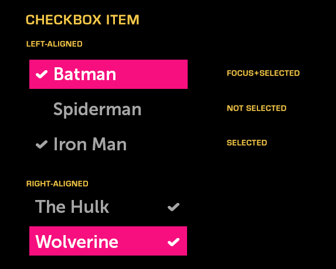

% Checkbox Item

## About

A Checkbox Item combines a checkbox with a text item.

## API Reference

[moonstone/CheckboxItem]($api/#/kind/moonstone/CheckboxItem)

## Behavior and States

### Behavior

A Checkbox Item takes a text item and adds the ability to track selection state.
If the item is selected, it will be decorated with a left-aligned or
right-aligned checkmark.

Checkbox Items may be used in lists and groups.  In a list, they may be selected
and deselected independently.  When grouped, only one item within the group may
be selected at any given time; when the user selects a new option, the
previously-selected option is automatically deselected.

### Sizing

A Checkbox Item has a minimum width of 300px; the maximum width is constrained
by the container.  If the text is too long for the available space, it will be
truncated and ellipsized, and will marquee (i.e., scroll horizontally) when the
item is focused.

## Illustration

