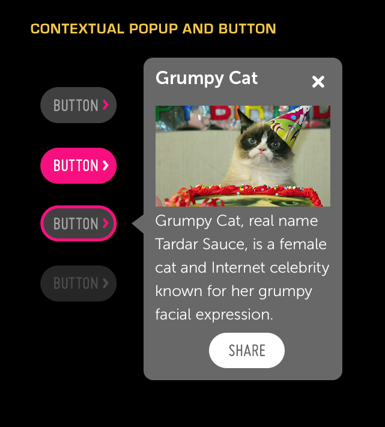

% Contextual Popup

## About

A Contextual Popup is a modal container invoked via a button.  Contextual popups
allow users to access important or relevant information without changing the
current context or opening a new panel.

## API Reference

[moon.ContextualPopup]($api/#/kind/moon.ContextualPopup)

## Behavior and States

### Behavior

Contextual Popups are opened by selecting an activating button.  This button,
which may be of any type or size, is marked by a right-facing arrow.

A contextual popup will open on the top, right, bottom or left side of the
activating button.  It automatically positions itself where screen space allows
unobstructed display.  You may fix the direction, if desired, by specifying the
direction from which the popup should emanate.

In addition, the contextual popup has a nub that points toward the action
button; like the popup itself, the nub is automatically positioned.

An open contextual popup may be closed by clicking outside of the popup; it may
also be closed by using the Close (X) button in the upper-right corner.

Contextual popups may contain any control, and may scroll.  The content inside
the popup must never be more than one level deep.

### Sizing

Contextual popups have a minimum width of 300 pixels and a minimum height of 220
pixels.  The controls contained within the popup must conform to their normal
sizing guidelines.  Long lists in the popup may scroll.

Action Buttons in contextual popups have the same size requirements as Button
controls.

### Illustration

