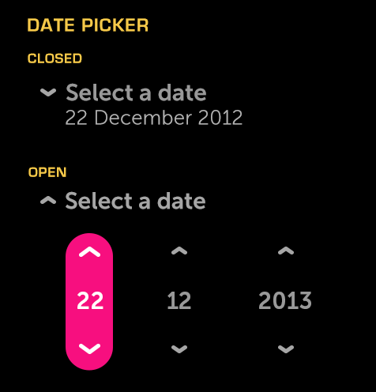

% Date Picker

## About

A Date Picker is a control used for selecting a date.

## API Reference

[moon.DatePicker]($api/#/kind/moon.DatePicker)

## Behavior

When closed, the first title line should inform the user of the picker's
function.  The second line of text shows the currently selected value.

When the picker is open, all content below is pushed downwards to make room for
the entire height of the picker control in its open state.

After selections have been made, pressing Enter/OK on the picker title will
close the control.  Once the picker is closed, the selected value(s) appear
beneath the title.

### States

* **Closed**
* **Focused (hover)**
* **Open**

### Sizing

The width of the control will automatically scale to fit the area containing the
control.

## Illustration

### Closed and Open

