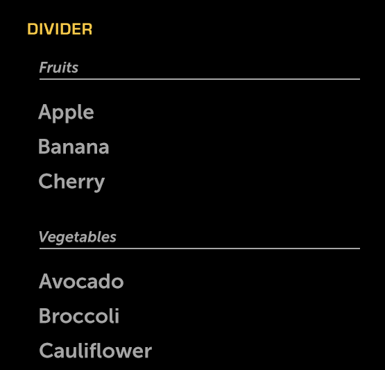

% Divider

## About

A Divider is a preformatted control that combines a text label and a horizontal
rule.  It may be used as a section header to separate the sections of a list.

## API Reference

[moon.Divider]($api/#/kind/moon.Divider)

## Behavior and States

### Behavior

A Divider is a non-actionable control comprised of a text label and a horizontal
rule.  The label may be customized in some, but not all, cases.  For example,
the divider's label may be set manually in a list, but in an expandable control,
it is automatically set to the title of the control.  

When a divider is used in conjuction with a scrolling list, the divider may
either scroll with the content or remain static, with content scrolling beneath.

### Sizing

By default, the horizontal rule extends the full width of the container.

The divider label may extend to the end of the horizontal rule; if overflow
content exists, the label will be truncated and ellipsized, and will marquee
(scroll) continually.

## Illustration

