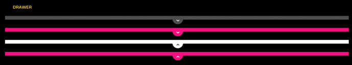

% Drawer

## About

A Drawer is a collapsible control that is always present in an application at
the top of the screen.

## API Reference

[moonstone/Drawer]($api/#/kind/moonstone/Drawer)

## Behavior and States

### Behavior

Drawers reside at the top of the screen, providing a persistent access point for
content within an app. 

By default, Drawers are closed.  A user may open a Drawer by selecting the
Drawer Handle.  When a drawer opens, all panels are pushed down.  By default,
the Top Drawer opens to fullscreen, but the behavior may be customized to make
it open partially.

In addition, it is possible to have multiple options within a drawer.  When
closed, a multi-option drawer appears as a normal drawer; when the control is
opened, a menu appears, allowing the user to select an option (from up to three
options in the Drawer).  Once an option is selected, the drawer opens fully to
reveal the related content.  Closing a multi-option drawer fully closes it.  A
user who wants to choose another option will have to close the Top Drawer and
reopen it.

### States

* **Closed**

    The Drawer is closed, but a Handle remains visible to all users and may be
    used to open the Drawer.

* **Open**

    The Drawer is open and its contents are visible to the user.

* **Focused (hover)**

    The Drawer currently has focus from the remote, and is ready to be selected.

### Sizing

The Drawer is the full width of the screen.  Its height varies based on the
content it contains.  The height may be fixed and the content may be scrolled.

## Illustration

