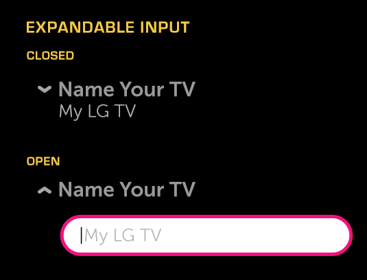

% Expandable Input

## About

An Expandable Input is an expandable control that contains a single-line input
field.

## API Reference

[moonstone/ExpandableInput]($api/#/kind/moonstone/ExpandableInput)

## Behavior and States

### Behavior

The Expandable Input has two states, open and closed.  When closed, the control
consists of a title describing the input's function and a text item displaying
either the current selection or the default selection.  The default will vary
depending on the options that are available in the open state.

The control is opened by focusing and then selecting it.  When the control
opens, the content below is pushed down to make room for the entire height of
the control in its open state.

When the expandable control is open, the layout consists of a divider control
(using the same title as in the closed state) and a single-line input field
under the divider.  When closed, the expandable input displays the title on the
first line and the value on the second line.

### States

The control will be in one of the following states at any given time:

* **Closed (Normal)**

    There has been no interaction with the button, but it is available for use.

* **Closed (Focused)**

    The control is being hovered over or has the focus from 5-way navigation.

* **Open**

    The control has been opened and changes may be made to the input.

### Sizing

The width of the expandable control automatically scales to fit the container.

### Illustration

