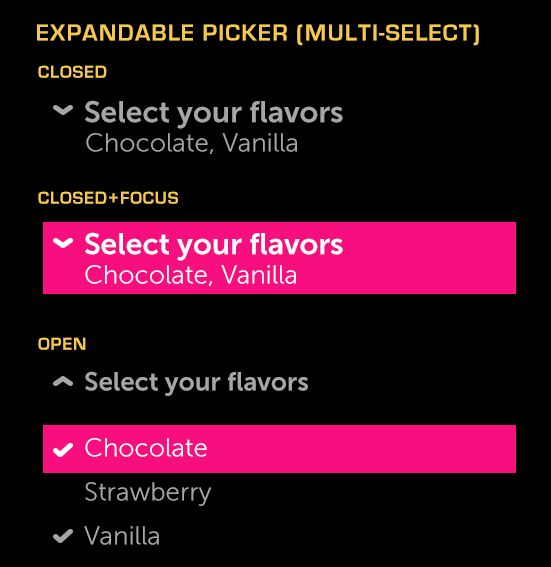

% Expandable Picker

## About

An Expandable Picker is an expandable control that opens to allow the selection
of a value from a list; the selected value is returned when the picker is
closed.

## API Reference

[moon.ExpandablePicker]($api/#/kind/moon.ExpandablePicker)

## Behavior and States

### Behavior

The Expandable Picker has two states, expanded and collapsed.  Expandable
pickers are suitable for use within lists; however, you should avoid using
multiple expandable pickers with a large amount of content in a single list, as
this can push the list offscreen, making it easy for a user to get lost.

By default, selecting an entry from an expandable picker will close the picker;
the picker will then display the selected value in its closed state.

Expandable pickers may be grouped so that only one picker in group may be open
at a time.

The expandable picker also supports multiple selection.  When selecting multiple
items, the user must select the title to close the list.  Multiple selection
should only be used with short lists of items.

### States

The control will be in one of the following states at any given time:

* **Closed (Normal)**

    There has been no interaction with the control, but it is available for use.

* **Closed (Focused)**

    The control is being hovered over or has the focus from 5-way navigation.

* **Open**

    The control has been opened and changes may be made to the picker.

### Sizing

The width of the expandable control automatically scales to fit the container.

### Illustration

