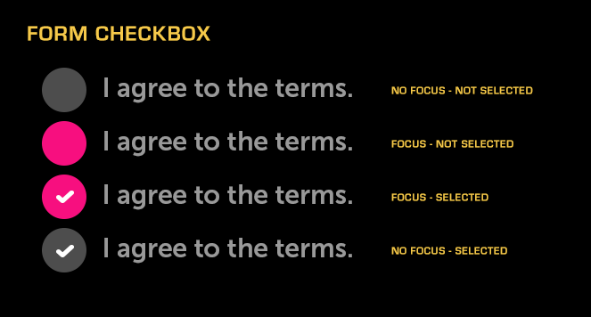

% Form Checkbox

## About

A Checkbox Form is a control that may be toggled on and off.  It is used in
forms to indicate agreement to conditions.

## API Reference

[moonstone/FormCheckbox]($api/#/kind/moonstone/FormCheckbox)

## Behavior and States

### Behavior

Form Checkbox is a focusable and selectable control, comprised of a circular
checkbox and a text label.  A checkmark in the circle indicates the selected
state, while the absence of a checkmark indicates the unselected state.

Form Checkboxes may be either independent or organized into groups.  When
ungrouped, each individual form checkbox may be selected or deselected
regardless of the state of any other form checkboxes.  When grouped, only one
form checkbox may be selected within a given group.  The selection of a new
option will cause any previously-selected option to be automatically deselected.

### States

* Normal (up/unpressed)

    The control is available for use and is not selected. There is no checkmark.

* Focus (hover)

    The control has the current focus from the remote and is ready to be
    selected.

* Selected (down/pressed)

    The control has been selected and a checkmark is displayed within the
    circle.

* Deactivated (disabled)

    The control cannot be selected and the circle does not appear.

### Sizing

If the text within a Form Checkbox is too long, it will be truncated and
ellipsized, and will marquee (scroll horizontally) when the control is focused.
Since there is a dedicated space for the checkmark, there is no need to worry
about truncation in the selected state, as there is with Checkbox Item.

### Illustration

