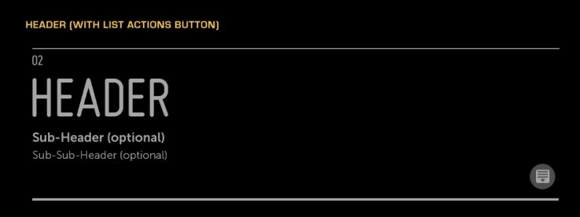
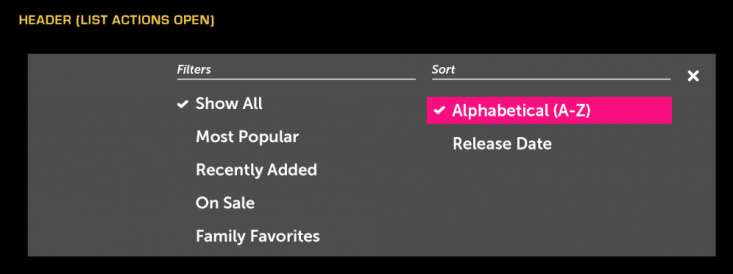
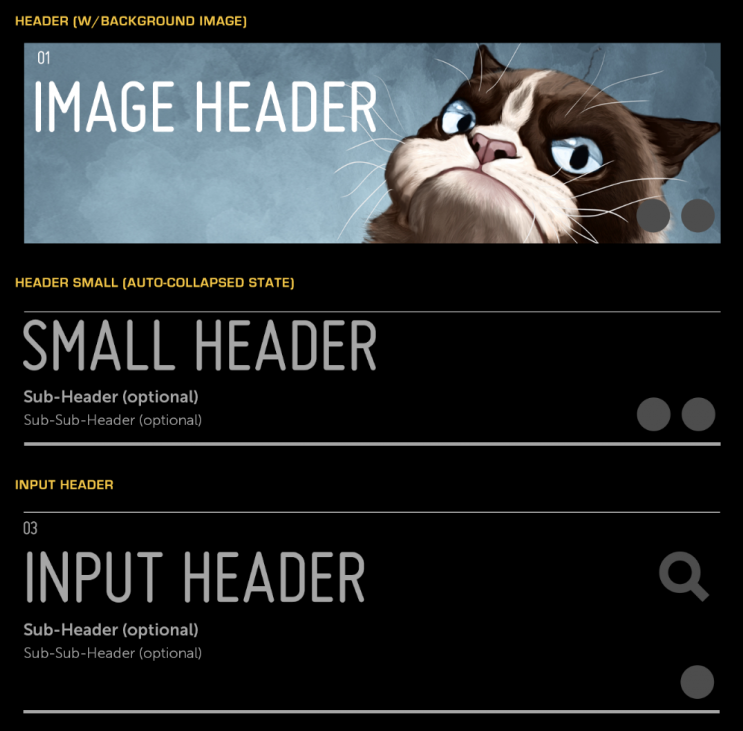

% Header/List Actions

## About

A Header is a predefined area at the top of each Panel.

The Header contains several text areas: a panel number, panel name, and optional
subheader and sub-subheader.  It also contains an optional Action Bar, which
contains Action Buttons.

An optional List Actions Menu appears in the Header when an Action Button is
pressed.  This menu allows the user to perform actions on an associated list of
content in the panel below.

## API Reference

[moon.Header]($api/#/kind/moon.Header),
[moon.ListActions]($api/#/kind/moon.ListActions)

## Behavior and States

### Behavior

#### Header

The Header is comprised of the following parts:

* Panel Title - Defined by application
* Panel Number - Automatically calculated
* Subheader - Optional
* Sub-Subheader - Optional
* Action Bar - In large headers, spans the full width; in small headers, spans
    half-width
* Background Image - Optional, may or may not repeat throughout the application

The Header's main purpose is to reflect the number of the Panel that the user is
currently in.  The Panel Number is automatically generated and depends on the
number of Panels that the user has navigated through.

Buttons, which may be found in the Action Bar within the Header, should behave
according to the normal Button control guidelines.  The buttons may be either
left-aligned or right-aligned, and may use Tool Tips to provide more context.

#### Action Bar

The Action Bar is an optional button area that provides a consistent location
for actions performed in the context of the current panel or current state of
the panel.  Common actions include: Filter, Sort, Search, Edit, Move, Delete,
Switch View, Share To, Add To, Favorite, Download, Buy, Rent, etc.

By default, all actions are aligned to the right.  When the user selects an
action that enables a mode (e.g., multi-select or edit), all actions in the
action bar may be replaced with confirmation actions such as OK or Cancel.  (See
[Multi-Select Mode](../patterns/acting-on-data/multi-select-mode.html) and [Edit
Mode](../patterns/acting-on-data/edit-mode.html).)

#### List Actions (Optional)

The List Actions menu is an optional menu invoked from a button in the header's
action bar.  It is only used when the selected action bar button has a list of
related actions, such as:

* Sort (by date, alpha, etc.)
* Filter (genre, release date, tv shows, movies, etc.)
* Share to (Facebook, Twitter, email, etc.)
* Add to (queue, playlist, album, etc.)

The List Actions menu should only be used for these kinds of actions; it should
not be used for any other purpose, such as navigation, shopping carts, or any
other complicated UI.  (See [Sort and
Filter](../patterns/acting-on-data/sort-and-filter.html).)

The List Actions menu may contain any control used in lists, such as checkbox
items or toggle items.  You may stack these lists or arrange them side-by-side
in columns.  When the lists are arranged in columns, they cannot exceed the
width of the menu.  Even though the List Actions Menu can scroll, if possible,
lists should not be stacked in a way that hides them from the user.  (See
Patterns for more examples of the types of controls used in the List Actions
menu.)

The menu may be automatically closed after a selection, or manually closed by
selecting the "X" in the upper-right corner.  Auto-close should only be used for
single-select lists.  Any changes made will be reflected when the List Actions
menu is closed.

### States

The Header has only one state.  When the Action Menu is open, the list control
has its usual states and behaviors.

### Sizing

The Header occupies the full width of a panel at a fixed height.  If the panel's
title is longer than the panel's width, the text is truncated and ellipsized,
and marquees (scrolls horizontally) when hovered over.

There are two sizes of Header, large and small.  In a large header, the Action
Bar spans the full width of the header; in a small header, the Action Bar shares
the header width with the subheader and sub-subheader.  Either size may be used
throughout an application.  The large header may be optionally configured to
automatically collapse into the small header when a list is scrolled.  (See
Patterns for examples of using the large and small header.)

The Action Menu opens on top of the Header and is the same size.  If the number
of controls in a list extends beyond the height of the Action Menu, the list
should scroll to reavel those items.

Lists within an Action Menu automatically expand to occupy the full width of the
Action Menu.  It is possible for a single list to be stretched to fill a wide
Action Menu.

## Illustration

### Header with List Actions Button

### List Actions Menu Open

### Different Variation of Header

