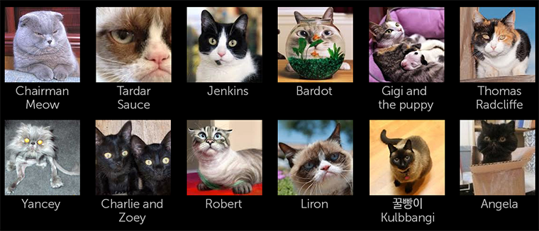

% Image Grid

## About

An Image Grid is a list container for displaying images or list items (list
groups).

## API Reference

[moonstone/DataGridList]($api/#/kind/moonstone/DataGridList),
[moonstone/GridListImageItem]($api/#/kind/moonstone/GridListImageItem)

## Behavior and States

### Behavior

#### Layout

Image Grid is a list container that displays images in a consistent grid layout.

The layout and size of an image grid is defined by the size of the grid items
within and the size of the area containing the grid.  The grid size is not
defined in terms of rows or columns.  If the area containing the grid changes in
size, items will be reorganized to fit within the new area.

Example: A 400x400-pixel image grid with 90x90-pixel list items would display
four rows and four colums.

Grids may be in one of three modes:

* **Fixed Size**

    All items have the same fixed size, which may be configured by setting the
    item's `width` and `height` properties.

* **Fluid Width**

    All items have the same size, but this size may grow or shrink to fill the
    size of the grid.  A minimum width may be set on the item to ensure that the
    image does not shrink below a specified size.

* **Normalize Rows**

    The height and width of the items are not known.  While the application is
    running, it is possible to get the dimensions of each item via the
    `sizeupItem` event.

#### Navigation

As focus moves through the Grid via 5-way navigation, grid items remain
stationary until the last fully visible grid item is in focus.  Once the user
navigates past this item, the grid shifts to accommodate the next row or column
of (previously) offscreen content.  If there are multiple offscreen grid items,
this process is repeated until the end (or beginning) is reached.  Rows and
columns may not shift independently; instead, the whole grid must shift.

Alternatively, users may use scroll bars for navigation when a grid goes beyond
the screen.  Scroll bars are only visible when a grid item is in focus.

### States

Grids do not have states.  Grid items may be in either the normal state or the
focused state.

## Illustration

