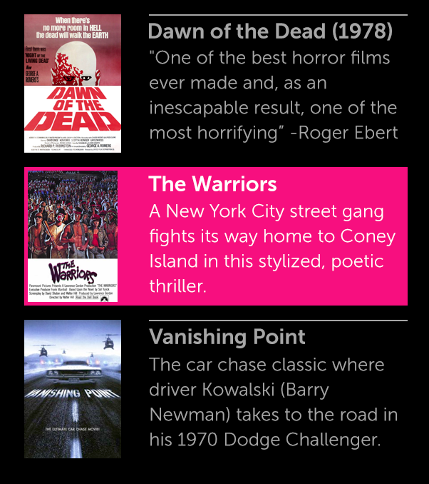
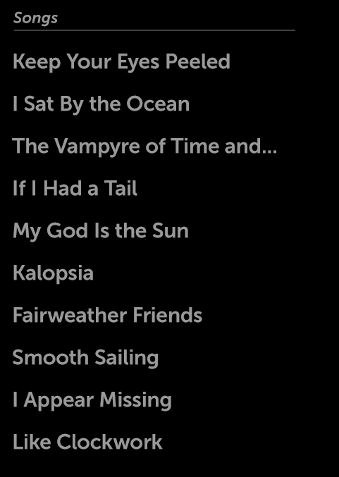
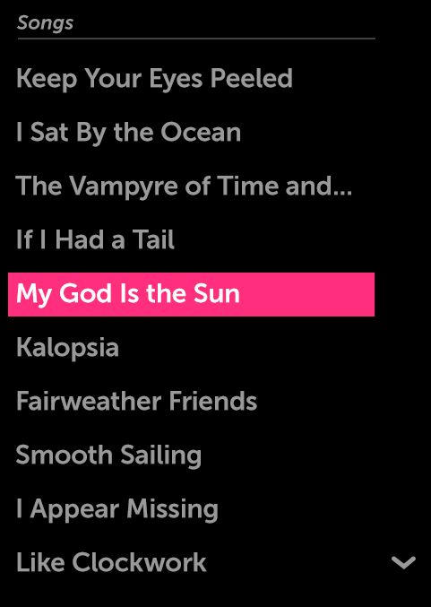
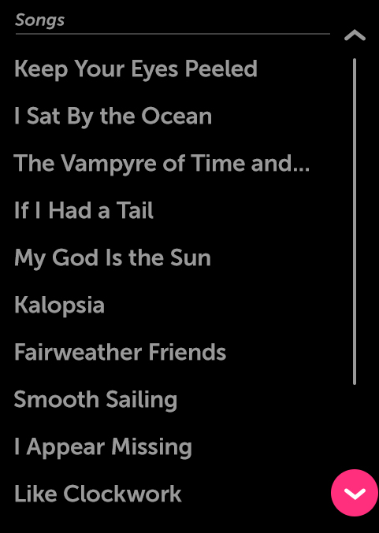

% List

## About

A List is a control used to organize groups of UI controls or other content that
a user may interact with or browse through.  Lists may be oriented either
vertically or horizontally.  When a list's contents overflow, a scroller will
appear.

## API Reference

[moonstone/DataList]($api/#/kind/moonstone/DataList)

## Behavior and States

### Behavior

Lists may be oriented either vertically or horizontally.

When a List is first opened, or navigated to, the focus moves by default to the
first list item, whether a UI control or content.  In a vertical list, this is
the topmost list item; in a horizontal list, it is the leftmost Item.

As focus moves through the list via 5-way navigation, list items remain
stationary until the last fully visible list item is in focus.  For longer
lists, once the user navigates past this item, the list will shift to
accommodate the next list item.  If there are multiple offscreen list items,
this process will be repeated until the end (or beginning) of the list is
reached.

Alternatively, users may use scroll bars for navigation when a list goes beyond
the screen.  Scroll bars are only visible when a list item is in focus.

### States

Lists do not have states; list content may be in either the normal state or the
focused state.  The UI controls in a list retain their usual states.

In a typical list, the focus starts on the topmost item.  As focus moves
downward, the list items remain stationary until the last fully visible list
item is in focus.  Subsequent down arrow keypresses will move the focus one item
per press.

### Scrolling

Lists can scroll horizontally or vertically.

Vertically-scrolling lists require an 80-pixel area on the right side of the
container to accommodate the scroller.  Similarly, horizontally-scrolling lists
require an 80-pixel area on the bottom side of the container to accommodate the
scroller.  The scroller is visible only when the focus is on the list container.

Two scroller arrow buttons appear when focus is over or inside a list.  The
buttons advance the content one "page" each time the button is pressed.  In this
context, a page is equal to the amount of content visible in the scrolling region.

The scroll indicator bar (a vertical line indicating the amount of content in
the list) is non-actionable and only appears during scrolling action, even when
focus is inside a list.

#### Accelerated Scrolling

When focus is inside a list and the down- or up-arrow button on the remote
control is pressed and held (long press), the list scrolling speed increases
over time, allowing for very fast and accurate scrolling through long lists.
This accelerated scrolling behavior may also be invoked by long-pressing the
onscreen scroller pagination buttons.

## Illustration

Here we see how a list item is repeated to create a list.

This list does not have focus, so its scroller is not visible.

When the list receives focus, the scroller appears.  In the following example,
the list is at the top, so only the down scroll button is shown.

The scroll indicator (vertical line) only appears while the list is being
scrolled.  Here we see that the down scroll button has focus.  Each press of
this button will advance the list one "page" at a time.

