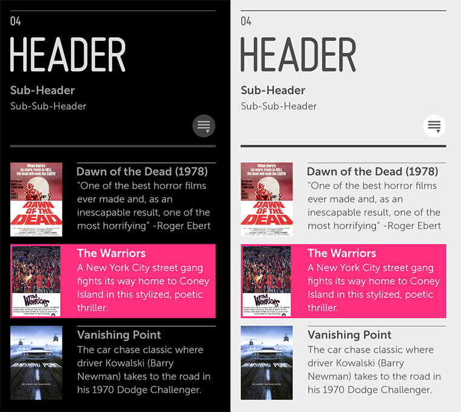

% Panel

## About

A Panel is a container that emanates from the right side of the screen.  Panels
are used to represent hierarchy in an application.

Moonstone panels feature a pre-formatted header, with a layout area below for
the main body content.

## API Reference

[moonstone/Panel]($api/#/kind/moonstone/Panel)

## Behavior and States

### Behavior

When a Panel is open, the content that it contains is visible.  When a user
selects a UI control that creates a new panel, the new panel slides in from the
right, collapsing the current panel into a breadcrumb on the left side of the
screen.  This breadcrumb may be clicked to bring the old panel back into view.

See the UI Patterns for different ways in which panels may be used.

### Sizing

By default, a Panel is fullscreen.  The panel's width is variable; for example,
a panel may cover half of the screen in the "Always Viewing" pattern.

See the UI Patterns for guidance on how to use different-sized panels.

## Illustration

