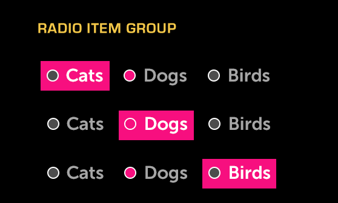

% Radio Item Group

## About

A Radio Item Group (or, simply, Radio Group) is a grouping of Radio Items (Radio
Buttons), only one of which may be selected at a time.  A Radio Group may also
be used for selecting a view.

## API Reference

[moon.RadioItem]($api/#/kind/moon.RadioItem),
[moon.RadioItemGroup]($api/#/kind/moon.RadioItemGroup)

## Behavior and States

### Behavior

Radio Buttons within a Radio Group may be organized either horizontally or
vertically, depending on the space allotted.  Each Radio Group must contain at
least two Radio Items.  Within a Radio Group, only one Radio Item may be
selected; when the user makes a new selection, any previously-selected item will
be deselected.

### States

* **Normal (up/unpressed)**

    The Radio Item is available for use and is not selected.

* **Focus (hover)**

    The Radio Item currently has focus from the remote and is ready to be
    selected.

* **Selected (down/pressed)**

    The Radio Item has been selected.

* **Deactivated (disabled)**

    The Radio Item cannot be selected.

### Sizing

By default, the text in a Radio Item dictates the width of the item, but you may
specify a fixed width, if desired.  In the event that the text exceeds the fixed
width, the text will be truncated and ellipsized.  When focused, the text will
marquee (scroll horizontally).

The height of the Radio Group is dictated by the number of buttons the group
contains.  It is possible to fix the height, in which case scrolling may be used
to reach the rest of the items in the group.  However, this isn't advised, as
this is a single-select situation and scrolling makes it more difficult for the
user to compare options within the Radio Group.

## Illustration

