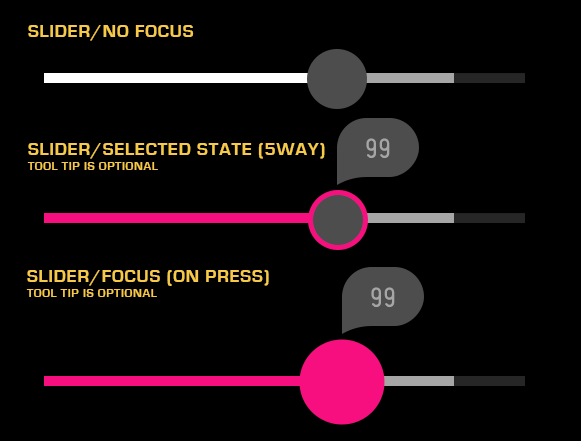

% Slider

## About

A Slider is a control for setting a value along a defined range.  It is commonly
used for adjusting system settings such as contrast and brightness.

## API Reference

[moon.Slider]($api/#/kind/moon.Slider)

## Behavior and States

### Behavior

A Slider consists of a Bar (whose ends represent the Slider's upper and lower
limits), the Current Value, and the Selector.  There is also an optional
Buffering bar that may be used, if needed.

The value of the Slider may be changed using either the Magic Remote or 5-way
navigation.  Using the Magic Remote, press and hold **Select** while moving the
remote.  Releasing the Select button returns the Slider to its normal state.
Using 5-way, first press Select, then use the arrow buttons to move the
Selector.  To exit active state, press Select again.

There are several options that may be configured to customize the Slider and its
behavior.  These include the following:

* **Lock Bar**

    When disabled, Lock Bar prevents the Current Value from changing in response
    to selector movement.

* **Constrain**

    When enabled, Constrain will prevent the Current Value and Selector from
    going past the Buffering position.

* **Tool Tip**

    The Tool Tip is used to display either a value or a percentage when the
    Selector is moved.

* **Tappable**

    When Tappable is enabled, users with a remote may point at a location on the
    slider and press **Select** to change the value.

* **Animation**

    Animation works in conjunction with Tappable.  With Tappable enabled, after
    tapping on the slider, the Selector will either slide to the new location
    if animation is enabled), or jump to the location (if animation is disabled).

### States

* **Normal (up/unpressed)**

    The Slider is available for use and is not selected.

* **Focus (hover)**

    The Slider current has focus from the remote and is ready to be selected.

* **Active (down/pressed)**

    The Slider has been selected and the value may be changed.

* **Deactivated (disabled)**

    The Slider cannot be selected or changed.

### Sizing

The Bar dictates the overall width of the control; it has a default width of 300
pixels.  While this width is configurable by the developer, the height is not.
The Current Value may not exceed the limits from the Bar, but may be constrained
due to the Lock Bar or Constrain properties.  In addition, the Buffering bar's
width may not exceed that of the Bar, but is otherwise not constrained.

## Illustration

