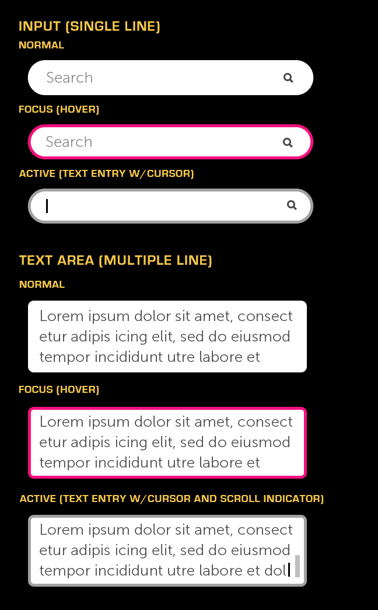

% Text Input

## About

Text Inputs are regions for displaying text or entering text via a keyboard.
Moonstone provides both Single-Line and Multi-Line text inputs.

## API Reference

[moonstone/Input]($api/#/kind/moonstone/Input),
[moonstone/RichText]($api/#/kind/moonstone/RichText),
[moonstone/TextArea]($api/#/kind/moonstone/TextArea)

## Behavior and States

### Behavior

#### Single-Line Input

Single-line inputs (e.g., Input and RichText) are typically used in forms or as
search fields.  If necessary, a small icon may be shown on the right side of the
input to clarify its purpose.

#### Multi-Line Input

Multiple-line inputs (e.g., TextArea) may be used for entering larger amounts of
text.  They should be used sparingly, however, as we discourage a lot typing in
the TV environment.

Multi-line inputs scroll when the user types beyond the limits of the container.

While typing, if the entered text grows beyond the size of the text field, the
beginning characters move offscreen in a marquee fashion.  The 5-way may be used
to return to the offscreen content.

If the final entered text is longer than what the field can display, it will
appear as truncated and ellipsized in the normal state.  In the focused state,
either the full text will marquee (in Single-Line Inputs) or the user will be
able to scroll (in Multi-Line Inputs).

Both types of inputs can display hint text; this text should be limited to a few
words and should not go beyond the size of the text field.  Once the user types
in the field, the hint text is replaced by what the user has entered; depending
on the context, the hint text may be retained or reset.  The hint text is shown
in both normal and focused states, but in the active state it is replaced with a
blinking cursor.

The virtual keyboard launches onscreen as soon as the user clicks on a text
input.  Until then, the keyboard remains hidden in order to maximize screen real
estate.

### States

* **Normal (up/unpressed)**

    The Text Input is available for use and is not selected.

* **Focused (hover)**

    The Text Input currently has focus from the remote and is ready to be
    selected.

* **Active (down/pressed)**

    The Text Input has been selected and is ready to accept text entry via the
    onscreen keyboard.

### Sizing

Text inputs have a default minimum width of 300 pixels, but the maximum width is
configurable.  The text entered may extend beyond the size of the text field.

The height of a Multi-line Text Field may be configured as needed, while the
Single-Line Text Field is constrained to a single line.

The optional small icon that may be displayed in the single-line text field is
20px.

## Illustration

