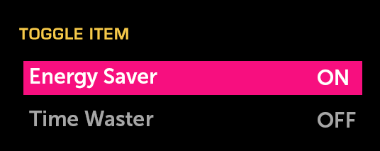

% Toggle Item

## About

A Toggle Item is a control that, when selected, toggles between two states or
actions.

## API Reference

[moonstone/ToggleItem]($api/#/kind/moonstone/ToggleItem)

## Behavior and States

### Behavior

Toggle Item is a focusable and selectable control with selected and deselected
states clearly denoted as "ON" and "OFF".  The text labels for these states are
not configurable, but will be localized.

Toggle Items may be independent or organized into groups.  Independent toggle
items may be selected or deselected with no impact on other toggle items.  When
toggle items are grouped, only one item in the group may be selected at a time.

If one toggle item in a group is switched "ON" and a user selects a different
item, the first will automatically switch to "OFF" when the current selection
updates to "ON".

### States

* **Normal (up/unpressed)**

    The control is available for use and is not selected; it is in the "OFF"
    state.

* **Focused (hover)**

    The control currently has focus from the remote and is ready to be selected.

* **Selected (down/pressed)**

    The control has been selected and is in the "ON" state.

* **Deactivated (disabled)**

    The control cannot be selected; it is in the "OFF" state.

### Sizing

If the text within a Toggle Item is too long, it will be truncated and
ellipsisized, and will marquee (scroll horizontally) in the focused state.
Since state is always represented, there is no need to worry about truncation of
selection state, as there is with Checkbox Item.

## Illustration

