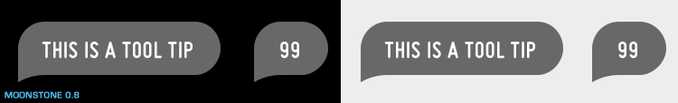

% Tool Tip

## About

A Tool Tip is a text-based, non-modal popup that appears when a UI control is in
the focused state.  Tool Tips provide additional information about the
currently-focused control.

## API Reference

[moonstone/Tooltip]($api/#/kind/moonstone/Tooltip)

## Behavior and States

### Behavior

A Tool Tip has a Body area containing text-based content, along with a Tip.  The
text is centered within the body, and should be as concise as possible.

A Tool Tip may be positioned on any side of a UI control; the center of the tip
will be aligned with the associated control.

UI controls may display Tool Tips when in the focused state.  When a control
with a tool tip loses focus, the tool tip disappears.  The tool tip's behavior
may be customized so that it displays instantly when the control gains focus, or
has a longer delay.

## Illustration

