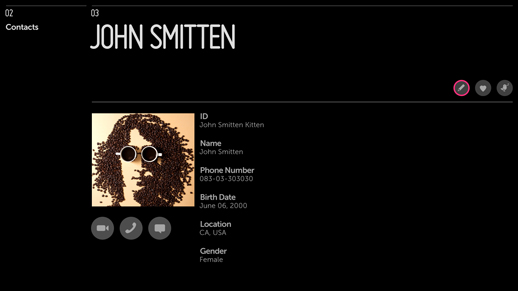
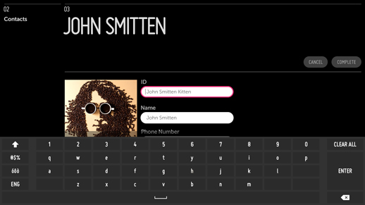
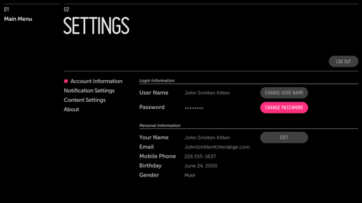
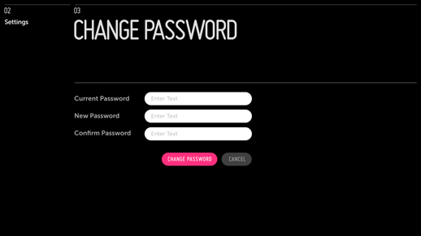

% Edit Mode

## Problem

The user needs to edit details such as account information.

## Solution

While text input should generally be avoided on the TV, there are certain cases
where a user must correct or update information (e.g., Contact Information or
Account Information).  For such cases, we provide two editing patterns: **Inline
Editing** and **New Panel Editing**.

**Inline Editing** should be used only when the editing is not the primary use
of the panel.  For example, a Contact Details panel is primarily used for
viewing a contact's information and initiating a video, voice, or instant
message conversation with that person.  Occasionally, this information needs to
be edited.  In this case, use a button in the Action Bar to invoke Edit Mode.

**New Panel Editing** should be used when editing is the panel's primary
purpose.  For example, a user typically visits an Account Details panel only
when this information needs to be changed.  Since account information can often
be divided into multiple sections (e.g., User Info, Personal Info, Billing Info,
Shipping Info), a sectioned detailed page is the best way to present this
information.  This approach also allows for an Edit button to be placed within
each section.  Selecting one of these Edit buttons will open a new panel for
editing the current section only.

## How to Use

### Inline Editing

Add an Edit action button to the Action Bar.

Clicking Edit should put the current panel into Edit Mode:

* The subheader or sub-subheader provides onscreen direction.
* The buttons in the Action Bar are replaced with confirmation buttons.
* Text fields turn into input fields. (See User Input Patterns.)
* Images receive edit options such as Delete, Upload, etc.

(Note that clicking Edit should **not** open a new panel.)

Once in Edit Mode, the first editable item should receive focus.  If this is an
input field, the keyboard will automatically open.

Once the edits are complete, the user may confirm or cancel the changes.  Then
Edit Mode will be disabled, the confirmation buttons in the Action Bar should be
dismissed, and the action buttons should return.

A confirmation message should be provided in the subheader or as a popup at the
bottom of the screen.

#### Example

In this example, the current panel is in a non-editable state.  This state is
consistent with the main use case for the panel--viewing contact information and
initiating a video, voice, or instant message conversation with the contact.

An Edit action button is provided in the Action Bar to enable inline editing.

Here the Edit action button has been selected and the panel is now in Edit Mode.
Editable text fields have been changed to input fields and the contact image now
has a button for changing the picture.

All of the action buttons in the Action Bar have been replaced with confirmation
buttons, and the subheader provides onscreen direction.

### New Panel Editing

Place an Edit button in the section to be edited.

Clicking the Edit button should open a new panel containing only the information
from that section.

* The subheader or sub-subheader provides on screen direction. 
* The buttons are removed from the Action Bar.
* Editable text fields turn into input fields. (See User Input Patterns.)
* Images receive edit options such as Delete, Upload, etc.
* Confirmation buttons appear at the end of the form. (See User Input Patterns.)

(Note: Do not open a new panel unless the user explicitly clicks the Edit
button.)

When entering the panel, the first editable item should receive focus.  If this
is an input field, the keyboard will automatically open.

Once the edits are complete, the user may confirm or cancel the changes.  Then
the Edit panel closes and focus returns to the Edit buttons on the previous
panel.

A confirmation message should be provided in the subheader or as a popup at the
bottom of the screen.

#### Example

In this example, the current panel is in a non-editable state.  The account
information is divided into sections, each with its own Edit button.

Selecting any one of these Edit buttons will open a new panel containing only
the information from that section.

Here a new panel has been opened for editing the information from the previously
selected section.

All editable text fields have turned into input fields, the subheader provides
onscreen direction, and the confirmation buttons are at the bottom of the form.

## What to Avoid

Do not make Edit Mode the default state of a panel unless editing data is the
panel's primary use case.

## Related Topics

Patterns: [User Input](../user-input.html), Notifications

Controls: [Text Input](../../controls/text-input.html),
[Button](../../controls/button.html),
[Header/List Actions](../../header-list-actions.html)
