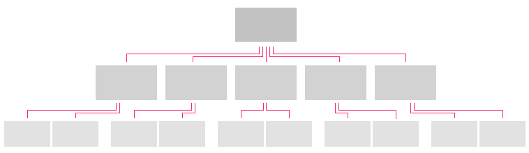
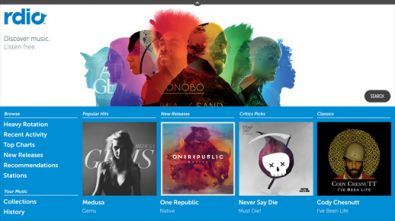
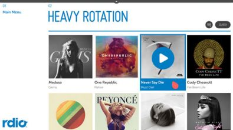
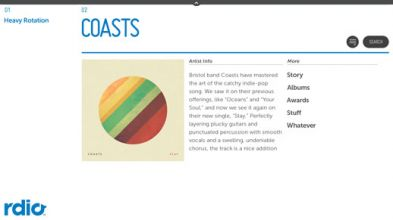
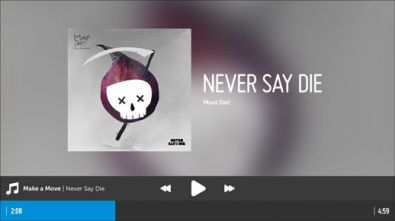

% Application Structure

Before choosing your first pattern, determine the structure of your application
(flat or hierarchical) and then review the articles on [Application
Layers](app-structure/app-layers.html) and [Panel
Structure](app-structure/panel-structure.html).  You should then be able to
[choose your first pattern](app-structure/panel-patterns.html) (Always Viewing
or Activity), which will set the scope for your application.

## Flat Applications

### General Structure

A flat application structure is used to present a single activity in a single
view, or multiple activities that exist as peers (i.e., each activity has direct
access to the other activities).

### How to Use

#### Single Activity

Single Activity applications, such as a Clock, Calculator, or Calendar, are not
common on the TV.  These apps tend to be more appropriate for personal computing
devices such as phones, tablets, or computers.  However, there are some fun
single activity applications that can be created for TV, such as the Yule Log,
Weather, or simple games like Mahjong.

Related Patterns: Full Screen Basement, Popup, Playback Controls

## Hierarchical Applications

### General Structure

A hierarchical application structure supports multiple activities with deep
navigation, where each level in the hierarchy has a different level of detail.
Switching activities requires navigating to a higher level (in most cases, the
top level).

### How to Use

#### Top Level

The Top Level (Panel 1) of your application is commonly used as a launch pad for
users to explore new items in different categories of the application, featured
content, and/or promotions.  Only information of the greatest importance to the
user should be displayed here, along with the means to navigate the
application's main menu.  This is where first impressions are made, so keep the
content and layout visually rich and engaging.

Related Patterns: [Hub and Spoke](navigation/hub-and-spoke.html), [Displaying
Data](displaying-data.html), [Panel Patterns](app-structure/panel-patterns.html)

#### Category Views

Category Views provide a slightly zoomed out view on an entire category of the
application.  This view commonly takes the form of a list with minimal details
for each list item.  When appropriate, the list should be organized with a
dynamically interesting layout, while remaining intuitive and easy to navigate.

Related Patterns: [Displaying Data](displaying-data.html), Lists and Grids,
[Acting on Data](acting-on-data.html), [Panel
Patterns](app-structure/panel-patterns.html)

#### Detail Pages

The Detail Page is either the final destination in the app or the launching pad
to the final destination.  While the layout will vary depending on the content
type, it should follow a simple pattern of displaying the most important
information on top, with all other information easily navigable through simple
scrolling.  Complex detail pages should group different detail types into
sections that only display a preview or subset of the data, along with a
**More** button to expand the section either inline or in the next panel.
Detail pages are also the best location for editing object-specific data (e.g.,
name, contact info, etc.).

Related Patterns: [Displaying Data](displaying-data.html), [Detail
Pages](displaying-data/detail-pages.html), Jump to Anchor, [Edit
Mode](acting-on-data/edit-mode.html), [Panel
Patterns](app-structure/panel-patterns.html)

#### Full Screen Basement

TV applications should take full advantage of the immersive experience the large
screen affords the user.  Whether the user is viewing a single video or photo,
or participating in a video chat, the default/primary experience should be
full-screen.  The Always Viewing Pattern makes the most of this by always
showing the basement and always loading selected content directly into the full
screen basement.

Related Patterns: Video Playback, Slideshows
