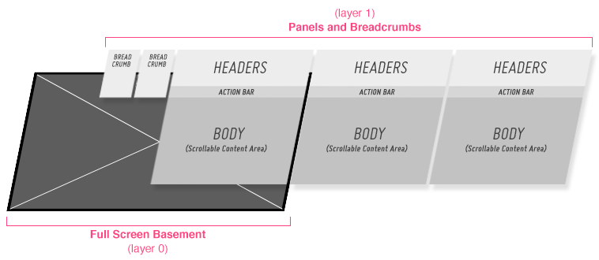
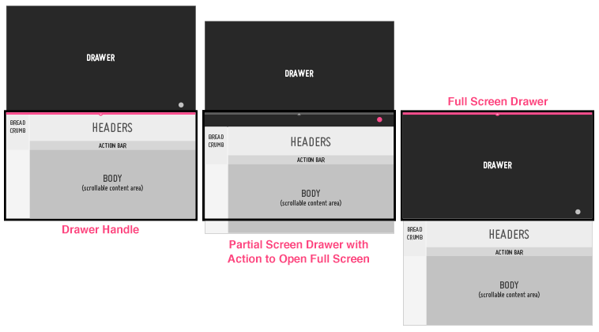
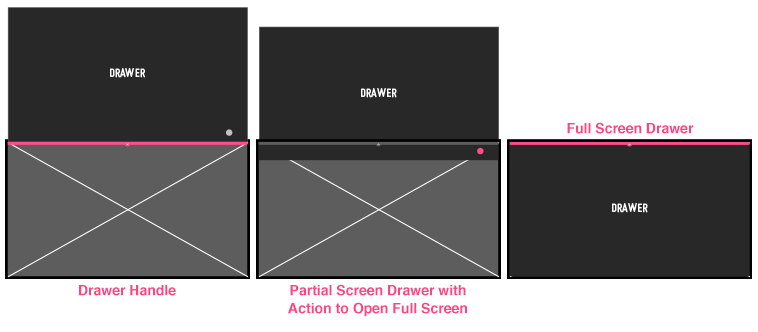
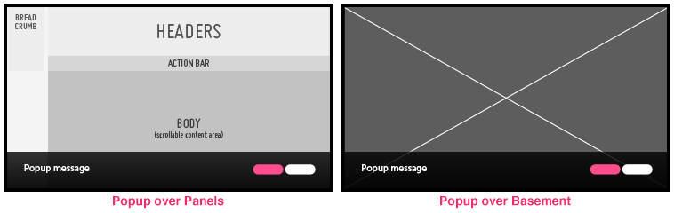

% Application Layers

## Panels and Basement

The bottom layer of an application is referred to as the "basement" and is used
for displaying fullscreen content such as video or photos.  The layer above
contains panels and drawers.  Panels slide in from the right of the screen.
When a new panel is opened, the previous panel transitions into a breadcrumb and
is pushed to the left.

When the basement has content loaded into it, a "hide panels"/"show panels"
indicator will appear on the right side of the screen.  If the user clicks the
"hide panels" indicator, all open panels and breadcrumbs will transition off
screen to the right.

If, while viewing the full screen basement content, the user clicks on the "show
panels" indicator, the panels will transition back in from the right; the last
panel the user was in will be open.

## Top Drawer

The Top Drawer is on the same layer as the panels.  This means that when the
drawer is opened, it pushes the panels down the screen.  When a drawer is
partially opened, such as in the Music Player Pattern, the header is still
visible, so that the user does not lose the context of the current panel.

Since the top drawer is on the same layer as the panels, if it is opened while
viewing the full screen basement, the drawer will open on top of the basement.

## Popups

Popups always open on the top layer of the application.  Whether you are in a
panel, a drawer, or the basement, any popups that you open will appear on a
layer above the rest of the app.

