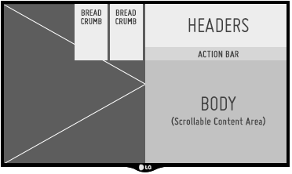
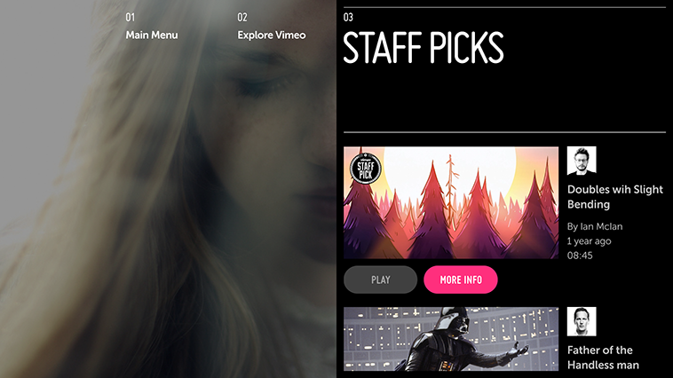
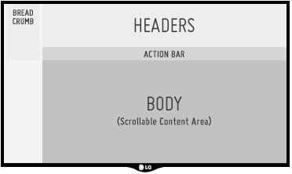
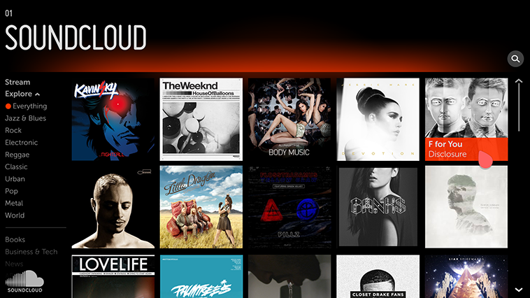

% Panel Patterns

Now that you're familiar with the big picture and the application structure,
it's time to choose your first pattern.  To accommodate the two main engagement
styles, we have created two core patterns.  The **Always Viewing Pattern** is
designed to support the high-absorption experience and the **Activity Pattern**
is designed to support the high-activity experience.

## Always Viewing Pattern

The Always Viewing Pattern puts the focus on your fullscreen content; the UI is
a simple, unobtrusive tool for presenting that content, with panels layered over
a portion of the screen.  This pattern is intended for applications that aim to
provide a constant stream of content to the user (e.g., Live TV and Pinterest).
It also works well for other content or media-rich applications that are willing
to sacrifice UI real estate for a more immersive experience.

## Activity Pattern

The Activity pattern provides a fullscreen UI experience suitable for more
task-based activities without overcomplicating or violating users' expectations
of TV.  While this pattern may also be used for fullscreen content delivery, it
does not support the simultaneous display of fullscreen content and the panel
UI.

