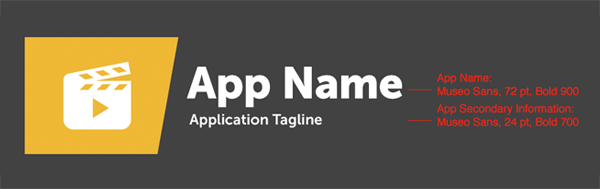
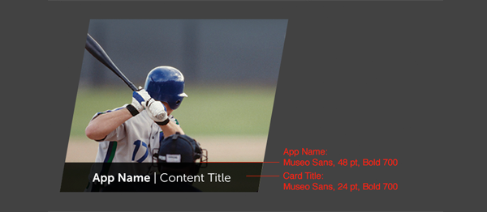
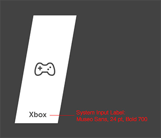
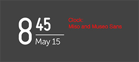

% Fonts

## Application Fonts

We recommend that developers use files in the WOFF or TTF format when building
apps.

Any font may be used, but the developer is responsible for abiding by any
license and distribution requirements. 

If your app uses non-system fonts, they should be downloaded with the app.
While it is technically possible to load fonts from remote sources, this is
discouraged, as it results in slow loading times.

### Fonts in Enyo Apps

In Enyo apps, we recommend that developers use the **Museo Sans** and **MISO**
fonts for languages with Latin scripts.

For languages with non-Latin scripts, use the **LG Display** font.

## System Fonts

The webOS for TV operating system uses the **Museo Sans** font family.

### Examples

#### App Tile on Home Screen

#### App Tile on Apps Screen

#### App Tile on Recent Screen

#### System Input

#### System Clock

