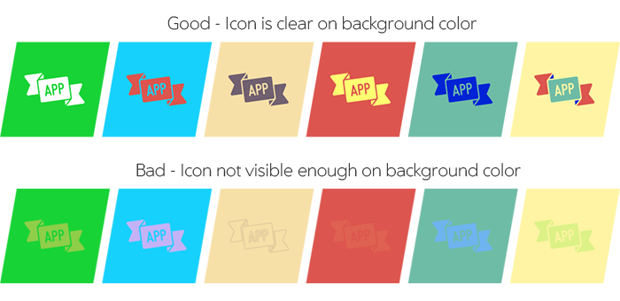
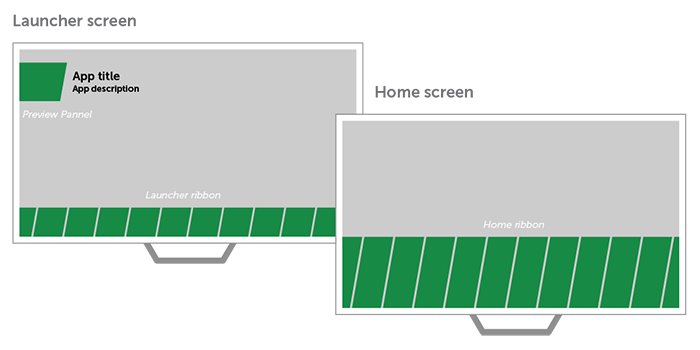
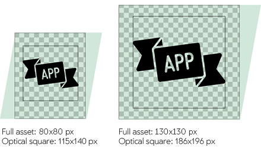

% Icons

## What Is an Icon?

An icon is a graphic that takes up a small portion of the screen real estate.
It provides a quick, intuitive representation of an app.

## Style

Icons should be designed with a distinct silhouette.

They should be two-dimensional and flat. 

Icons are displayed on a solid-colored background panel.  You may specify the
color of the background panel using hexadecimal notation (HEX).

Avoid using visual effects, as they will make your icon look inconsistent with
the flat style of the system UI.

## Color

Make sure you choose the correct colors for your icon and background panel. 

While the icon color and the background panel color should reflect your brand,
it is important to maintain good contrast.  The icon should stand out clearly
against the background panel.  A lack of contrast can make the icon difficult to
see and understand.

Note that System app icons are gray (#4a4a4a) against a white background:

## Sizes and Scale

Application icons are displayed on background panels of three different sizes.

The background panels on the Launcher ribbon and the Home ribbon have different
heights; however, they display the same-sized icons.

The Preview background panel shows a larger-sized icon.

## File Format and Positioning

Icons should be in the PNG file format, and should use transparent properties.

They should be placed within a transparent space so they will fit nicely on the
panel without being too close to any of the edges.

