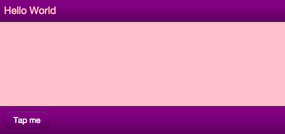

% UI Theming

## Overview

Enyo offers two first-class UI widget sets: Onyx, which contains a wide
variety of native-quality controls for building Enyo applications, and Moonstone,
which offers controls tuned for use on smart TVs.
While you are certainly welcome to use Onyx and Moonstone controls straight out
of the box to develop your app, we know that many developers will want to adapt
the look and feel of these widgets to meet the design requirements of their
particular projects.  To that end, we offer three discrete "theming" strategies.

Which strategy will work best for you depends largely on the degree of
customization you need.  In this document, we discuss the three approaches to
theming, proceeding in order from least-effort-and-least-flexibility to
most-effort-and-most-flexibility:

* **Variable-Based Theming:** Customization of pre-defined variables that
    control styling
* **Rule-Override Theming:** Free-form overriding of rules that control
    styling
* **Library-Based Theming:** Creation of new Enyo kinds, extending Onyx,
    Moonstone, or the Enyo core UI.

## Variable-Based Theming

In variable-based theming, you simply override the default values of certain
variables that are used to generate CSS stylesheets.  For example, you could set
the `@onyx-toolbar-background` variable to `orange` to make all of your app's
`onyx/Toolbar` controls orange.

Since the 2.1 release, Enyo has included support for [LESS](http://lesscss.org/),
a dynamic stylesheet language that extends CSS with features such as variables,
mixins, operations, and functions.  Enyo's variable-based theming leverages LESS
to break out common styling parameters into semantically-named, easy-to-override
variables.

### Enyo's LESS Integration

If you include `.less` files alongside `.css` files in your `package.json`, they
can be transparently compiled into traditional CSS during the `enyo pack` process.
This capability is enabled right out of the box, without any
additional tools or setup.

### Overriding Onyx Variables

Onyx's CSS lives inside two key files: `onyx-variables.less` and
`onyx-rules.less`.  Onyx's default theme is built from these two files and is
included in your app whenever you `require()` and Onyx component.

If you're using the `enyo-dev` `onyx-app` template, you can easily
create and use a custom theme for Onyx as follows by editing `css/main.less` and
adding any variable or rule overrides you need.

### Onyx Variables: A Quick Tour

The following is a high-level overview of the types of variables that you may
define in your theme to control the look and feel of Onyx.  Refer to
[onyx-variables.less](https://github.com/enyojs/onyx/blob/master/css/onyx-variables.less)
for a complete list of the available variables and their default values.

* Font: `@onyx-font-family`

* Font-size:
	* High-level: `@onyx-font-size-small`, `@onyx-font-size-medium`, `@onyx-font-size-large`
	* Widget-level: `@onyx-<widget-name>-font-size`

* Text color:
	* High-level: `@onyx-text-color`
	* Widget-level: `@onyx-<widget-name>-text-color`

* Background color:
	* High-level: `@onyx-background-color`
	* Widget-level: `@onyx-<widget-name>-background-color`

* Border radius:
	* High-level: `@onyx-border-radius`, `@onyx-border-radius-tight`
	* Widget-level: `@onyx-<widget-name>-border-radius`

* Padding
	* Widget-level: `@onyx-<widget-name>-lr`, `@onyx-<widget-name>-tb`

* Icon Size: `@onyx-icon-size`

* Disabled Opacity: `@onyx-disabled-opacity`

* Gradient Overlays: `@onyx-gradient` and `@onyx-gradient-invert`

* Images: `@onyx-<widget-name>-image`, `@onyx-<widget-name>-image-width`,
    `@onyx-<widget-name>-image-height`

### Overriding Moonstone Variables

Similar to Onyx, Moonstone's CSS is split between variables and rules.  Additionally,
Moonstone includes both a light and a dark theme.  To select the light theme, add the following
line to your `css/main.less` file:

```
    @moon-theme: 'light';
```

When using the `enyo-dev` `moonstone-app` template, you can easily create and use a
custom theme by defining any variable or rules overrides in the `css/main.less` file.

### Moonstone Variables

Moonstone employs a much finer-grained approach to specifying default values for
various controls than Onyx does.  Refer to the Moonstone `css` directory and the
corresponding light or dark `less` file for a complete list of the available
variables and their default values.

### Variable Overrides in Action

As a quick illustration of how the variable-override syntax works, if you were
to create a simple "My Little Pony"-inspired theme, the `main.less` file might
look like this:

```
        @onyx-text-color: pink;
        @onyx-toolbar-text-color: pink;
        @onyx-button-text-color: pink;

        @onyx-background: pink;
        @onyx-popup-background: pink;
        @onyx-toolbar-input-background: pink;

        @onyx-button-background: purple;
        @onyx-groupbox-background: purple;
        @onyx-progressbar-bar-background: purple;
        @onyx-toolbar-background: purple;
        @onyx-toolbar-button-background: purple;
        @onyx-tooltip-background: purple;

        @onyx-border-radius: 15px;
        @onyx-border-radius-tight: 15px;
```

If we take this custom theme and apply it to the app template--following
the steps outlined above--the results are stunning:



## Rule-Override Theming

When no variable exists for the piece of CSS you want to customize, your next
option is to use a CSS rule override.  Rule overrides go in the aforementioned
`css/main.less` file.

Let's say you want to change the color of the glow that surrounds a focused
input.  `Input.less` doesn't break that value out into a variable, but we can
look up the name of the relevant style in `Input.less` and write a custom rule
to override the default color.

### Global Overrides

To override a rule globally (so the override applies to all widgets), simply
define the rule overriding the property (or properties) whose styling you wish
to customize.  In the case of the input glow color, that might look like the
following:

        /* Add a nice red glow to input decorators */
        .onyx-input-decorator.onyx-focused {
            box-shadow: inset 0px 1px 4px rgba(255,0,0,0.3);
        }

### Selective Overrides

Of course, you may wish to be more selective about where your rule overrides are
applied.  In that case, simply define your rule override using a compound
selector; that is, add an additional class to the definition, such as
`.red-glow` below:

        /* Add a nice red glow to input decorators */
        .red-glow.onyx-input-decorator.onyx-focused {
            box-shadow: inset 0px 1px 4px rgba(255,0,0,0.3);
        }

Now the rule override will only affect instances of
[onyx.InputDecorator]($api/#/kind/onyx.InputDecorator) that have the selecting
class (`'red-glow'`) applied, e.g.:

        components: [
            {kind: OnyxInputDecorator, classes: 'red-glow', components: [
                {kind: OnyxInput}
            ]}
        ]

Alternatively, you may apply the selecting class to a parent component, which
will cause all of its child input decorators to receive the override:

        components: [
            // Standard Input
            {kind: OnyxInputDecorator, components: [
                {kind: OnyxInput}
            ]},
            // Both input decorators will have 'red-glow' applied
            {classes: 'red-glow', components: [
                {kind: OnyxInputDecorator, components: [
                    {kind: OnyxInput}
                ]},
                {kind: OnyxInputDecorator, components: [
                    {kind: OnyxInput}
                ]}
            ]}
        ]

## Library-Based Theming

Finally, there may be situations in which the look-and-feel changes you want to
implement lie beyond the styling capabilities of CSS.  This is often the case
when DOM or behavioral changes are required.

For example, you might want to implement a `"Slider"` as a rotary dial instead
of a horizontal track with a handle.  Even if your new `Slider` has the exact
same API as [onyx/Slider]($api/#/kind/onyx/Slider/Slider) (i.e., the same published
properities and bubbled events), it will still require completely different DOM,
CSS, and internal event tracking.

In this scenario, the idea of "theming" grows to encompass the building of a new
library, made up of (one or more) Enyo kinds that implement your desired
look-and-feel, while allowing you the freedom to implement custom DOM, CSS, and
behavioral logic as needed.

In keeping with Enyo's emphasis on reusability, we encourage you to follow
certain best practices when creating alternate UI libraries:

* When possible, extend from Enyo's base UI library, found under
    `enyo/source/ui`.  That folder contains an assortment of unstyled Enyo kinds
    that wrap common HTML form elements, such as:

    * Button
    * Checkbox
    * Image
    * Input
    * Popup
    * RichText
    * TextArea

* When providing an alternate implementation of a higher-level UI component not
    supplied in the base UI (such as a Menu or Slider), consider extending from
    the equivalent Onyx kind (and thus starting from the same API for published
    properties, events, and functions) and overriding where necessary.
