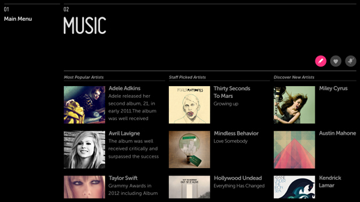
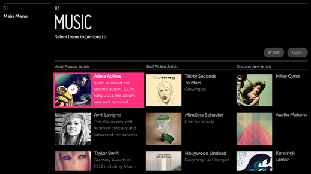
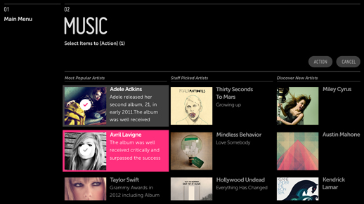
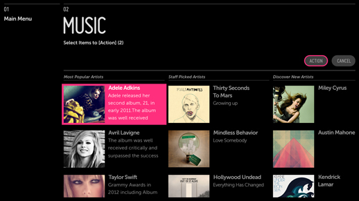

% Multi-Select Mode

## Problem

The user needs to select multiple items from a list to perform actions such as
Share To, Add To, Delete, or Favorite.

## Solution

Use an action button from the Action Bar or an action item from a List Actions
menu to put the list or grid into multi-select mode for performing the selected
action.

## How to Use

For actions such as Delete and Favorite, use an action button in the Action Bar
to invoke multi-select mode on the content below.  This will allow the user to
apply a single action to multiple items.

For actions such as "Share To" and "Add To", use an action button in the Action
Bar to open a List Actions menu of targets to share or add to.  Selecting a
target will hide the menu and invoke multi-select mode on the content below,
allowing the user to apply a single action to multiple items. 

Once an action has been selected, the list or grid should be in Edit mode (with
focus on the first item in focus when using the 5-way).

Replace the action buttons in the Action Bar with confirmation buttons (i.e.,
Delete/Cancel or Share/Cancel).

Use the subheader to provide onscreen direction (e.g., "5 items selected for
deletion" or "3 items selected to share to Facebook").

Select the items and then confirm the action.

Once the action has been performed on the selected items, disable multi-select
mode, dismiss the confirmation buttons, and return the action buttons to the
Action Bar.

Provide a confirmation message in the subheader or as a popup at the bottom of
the screen.

For actions such as "Add To", open a popup message at the bottom of the screen
offering a choice to stay in the current list/panel or return to the list/panel
the user just added content to.

The action Button has focus.  Click to initiate multi-select mode.

The first item has focus but is not yet selected.

The first item has focus and is selected.

The first item is selected.  The second item has focus but is not yet selected.

The first and second items are selected.  The action button has focus but is not
yet selected.

When the action is complete, focus returns to the first item in the list.

## What to Avoid

Don't allow user to use multi-select without first selecting the action button.

Don't use a contextual popup to display the List Actions menu.

## Why

Users may be interacting with a large volume of content and may want to take
broad action on that content.  By providing the multi-select tool, you make it
faster and easier for them to do so.

## Related Topics

Patterns: [Action Bar](../app-structure/panel-structure.html#action-bar),
[Action Menu](sort-and-filter.html),
Lists and Grids
