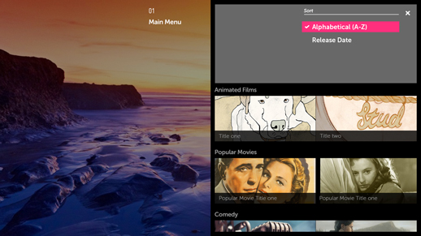
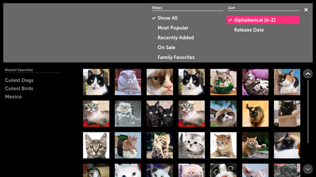

% Sort and Filter

## Problem

When navigating a long list of content, it may become tedious for the user to
scroll through all the available information to find a particular item.

## Solution

Sort and Filter can make it easier for the user to locate a specific item.
Like other actions with a list of sub-options to choose from (e.g., "Sort A-Z",
"Filter by Movies"), Sort and Filter may be implemented using a List Actions
menu that fills the Header space.  Using a List Actions menu, rather than
listing out all the options in a panel, has the added benefit of helping to keep
the app hierarchy shallow.

Sort actions allow the user to reorganize the data (e.g., alphanumerically, by
release date, by price, by rating), making it easier to navigate.

Filter actions allow the user to whittle down the list by hiding all content
types other than those selected to filter by (e.g., only show movies, or only
show action and comedy movies).

## How to Use

Add an Icon Button to the Action Bar.

Display the Sort and Filter options with a List Actions menu in the Header.

If you only need Sort or Filter, but not both, and you're using a single-select
list of options, once the user make a selection, the List Actions menu should
auto-close and the content in the panel should be updated.

All List Actions menus should include a Close button.

When using a Multi-Select list of Sort and Filter options, the content below the
List Actions menu should update with each selection.  The user must click the
Close button to close the List Actions menu before returning to the content with
the 5-way.

Use a list of Checkbox Items for your Sort and Filter options.  They will keep
track of which Sort and Filter options have been selected.

## Examples

This is an example of the single-select filter List Actions menu in an Always
Viewing Pattern.

Note how the focus is on the first item in the list and there is an Exit button
in the top right corner.

This is an example of a multi-select List Actions menu in an Activity Pattern.

The user may choose multiple options for sorting and filtering.

## What to Avoid

Do not use Sort and Filter menus for general navigation.

Do not put Sort and Filter menus in their own panel.

Do not use a contextual popup to display Sort and Filter options.  

## Related Topics

Patterns: [Panel Patterns](../app-structure/panel-patterns.html)

Controls: [List Actions](../../controls/header-list-actions.html),
[Button](../../controls/button.html), [Checkbox
Item](../../controls/checkbox-item.html).
