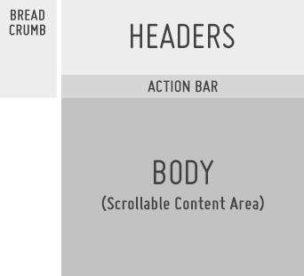

% Panel Structure

Panels are the core structural element for displaying content and navigating the
different views of an Enyo/Moonstone application.  Panels have several built-in
features (e.g., the header, action bar, body/content area, breadcrumbing, and
panel transitions), along with a responsive layout for cross-platform
compatibility.  Although panels and headers are covered in the Design Guide's
[UI Controls](../../controls.html) section, we would also like to look at how
these controls relate to patterns.

## Header

* The Header field is used to display the app name and/or panel name.

* It may also be turned into a search input field.

* The subheaders and sub-subheaders may be used to display additional panel info
    or contextual action info.

* The Header control height may be set to small to allow more room for viewable
    content below the action bar. 

## Action Bar

* The Action Bar provides a consistent location for actions that may be
    performed in the context of the current panel or current state of the panel
    (see [Acting on Data](../acting-on-data.html). 

* Common actions include: Filter, Sort, Search, Edit, Move, Delete, Switch View,
    Share To, Add To, Favorite, Download, Buy, Rent, etc. 

* By default, all actions are right-aligned.

* When a selected action enables a mode such as multi-select or edit, all
    actions in the action bar may be replaced with confirmation actions, such as
    OK/Cancel.  (See [Multi-Select Mode](../acting-on-data/multi-select-mode.html)
    and [Edit Mode](../acting-on-data/edit-mode.html).)

## Body

* The body of the panel may be used for navigation, content categories, content
    details, or whatever else your app would like to present (see
    [Navigation](../navigation.html), [Displaying Data](../displaying-data.html),
    [Acting on Data](../acting-on-data.html), and [User
    Input](../user-input.html)).

* Scrolling content in the body may optionally collapse the header to the
    smaller state to show more content.

## Breadcrumbs

* Breadcrumbing is a mechanism for backward navigation that provides context in
   terms of which panel the user will see when the breadcrumb is selected (see
   [Navigation](../navigation.html)).

* Opening a new panel will turn the current panel into a breadcrumb.

* The breadcrumb is a text-only object with a built-in numbering system.

## Hide/Show Panels

* When the basement has content loaded into it, a hide/show panels indicator
    will appear on the right side of the screen.

* If the user clicks the "hide panels" indicator, all panels and breadcrumbs
    will transition off screen to the right.

* If, while viewing the full screen basement content, the user clicks on the
    "show panels" indicator, the panels will transition back in from the right;
    the last panel that the user was in will be open.

## Related Topics

Patterns: [Navigation](../navigation.html), [Displaying
Data](../displaying-data.html), [Acting on Data](../acting-on-data.html)
