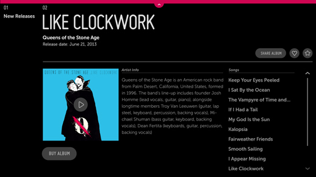
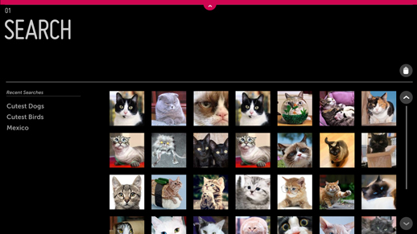
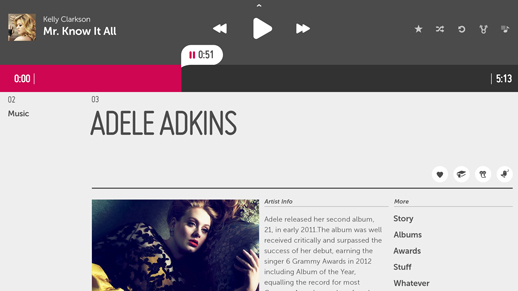
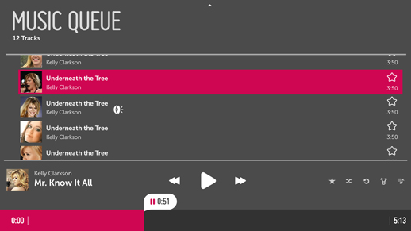

% Feature Navigation

## Problem

Users frequently need to access certain features of an app, such as Search,
Music Player, Shopping Cart, Wish List, etc.

## Solution

The Top Drawer gives users quick and easy access to an application's most
important features, no matter what panel they happen to be in.

## How to Use

### Example 1: Search

The Top Drawer is accessed via a handle at the top of the screen.

The width of the Top Drawer is equal to the width of the screen so that the user
can point anywhere along the top edge to access the drawer's handle.

In this example, the handle for the Top Drawer is in the focused state.  Once
the user clicks on the handle, the Drawer will open.

The Top Drawer is on the same layer as the panels.  When it opens, the drawer
pushes all panels and breadcrumbs down so that the breadcrumbs and panel headers
remain visible if the drawer is only partially open.

The Top Drawer may be set to any height; it is set to the full screen height by
default.

To manually close the Top Drawer, click the handle.  The drawer and panels slide
up to their default position.

In this Search example, if the user selects content from the drawer, the drawer
automatically closes and a Detail Panel opens.

### Example 2: Music Player

In this example the height of the drawer has been set so that it appears as
partially open, with a simple, persistent music player exposed.  This smaller
drawer gives the user quick access to the playback controls without taking over
the full screen.

Note the inclusion of list action buttons in this view.  One of these buttons
lets the user expand the partially open drawer to a fullscreen state.

In this case, clicking the Music Queue Action expands the drawer to fullscreen
so that the user can interact with the Music Queue.

## Why

The assumption behind this pattern is that non-productivity apps for TV do not
need many persistent features.  In fact, many will need none at all, while most
will need no more than one.

The most common persistent feature for TV apps is Search.  The Top Drawer is the
ideal place for this.  You may use it to provide access to Search throughout
your app, in a position of prominence on the screen.

Each app may have up to three Top Drawers.  This limit exists to keep the drawer
from becoming a dumping ground for features.

## What to Avoid

Do not include more than three options within the Top Drawer.

Do not use the Top Drawer for persistent, menu-based navigation.

## Related Topics

Patterns: [Global Navigation](global-navigation.html)

Controls: [Drawer](../../controls/drawer.html)
