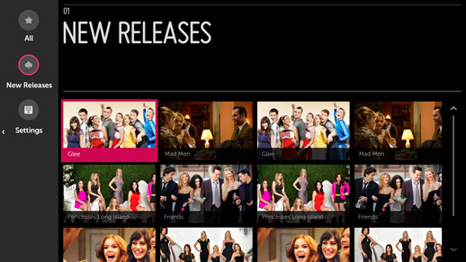
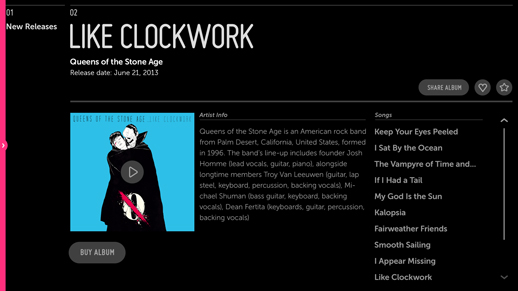
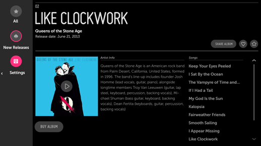

% Global Navigation

## Problem

An app requires global navigation so that the user can frequently and easily
navigate between its main categories, no matter where they happen to be in the
app.

## Solution

The Left Drawer (which is not yet implemented as a Moonstone control) provides
users with persistent access to global navigation no matter which panel they are
in.  Once the user navigates past panel 1, the Left Drawer closes to reduce the
clutter of unnecessary UI.  A left drawer handle remains available so that the
user can reopen the left drawer and change categories.

## How to Use

Above is an example of the Left Drawer with Panel 1.

The Left Drawer is the entire height of the screen and is always displayed when
the user is viewing Panel 1.

If the user selects a different item from the Left Drawer, Panel 1 is updated
with the new content. If the user selects an item from Panel 1, Panel 2 opens,
the Left Drawer closes, and Panel 1 becomes a Breadcrumb.

The Left Drawer is accessible from any panel with the Magic Remote pointer only.

When the drawer is hidden, the user must point to the Left Drawer Handle on the
left edge of the screen to reopen the drawer.

If the user selects an item from the Left Drawer, Panel 2 is replaced by Panel
1, which will be populated with content associated with the selection.  The user
may hide the Left Drawer by clicking to the left and collapsing the drawer.  The
user may also navigate back to the content in Panel 2.

## What to Avoid

* Do not use the right side for your drawer.  Panels open from (and close to)
    the right.  A right-side drawer would leave the the user confused and not
    knowing what to expect.

* Do not use the Left Drawer for Feature Navigation.

* Do not make the Left Drawer larger than the breadcrumb column.

## Why

* The Left Drawer gives the app a feeling of shallow navigation, which makes for
    a more lean-back experience for the user.

* In apps that make heavy use of menu items, this feature makes it easy for
    users to jump around from one section to the next without having to return
    to the main menu in Panel 1.

## Related Topics

Patterns: [Feature Navigation](feature-navigation.html)

Controls: [Drawer](../../controls/drawer.html)
