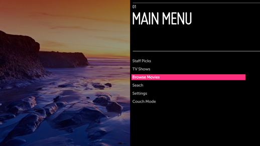
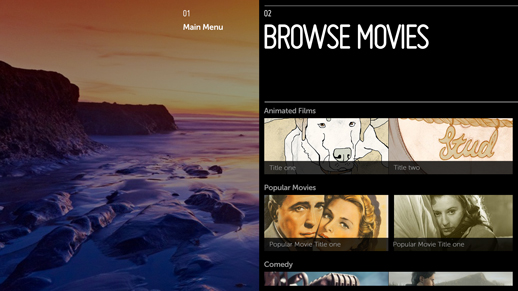
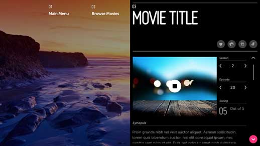

% Hub and Spoke

## Problem

An application needs a minimal UI to support a high-absorption experience.  The
main navigation will divide the app into discrete sections (e.g., Movies, TV
Shows, Settings) that the user will not regularly switch between.

## Solution

Using Panel 1 as the Hub of an app gives the user a home base from which to
explore each content category.  This lets the user focus on one type of content
or action at a time, while maintaining a shallow navigation structure.

To navigate to another main category, the user must first return to the Top
Level view.

## How to Use

Panel 1 is the Hub of the application.  The main menu can be a simple list of
categories or a more visually rich grid with previews of the content available
in each category as shown to the left.

Select a menu item to navigate into that spoke of the application.

After making a selection from Panel 1, the user begins the journey down the
Movies spoke.

The only way the user can begin exploring a different content category is to
return to the Hub (Panel 1) and choose another spoke.

Selecting an item from the options available in Panel 2 will move the user
further along the spoke.

Once the end of a spoke is reached (Panel 3), the user can explore the final
section by utilizing the Jump To Anchor, or make a selection to begin viewing
content.

The user may also choose to move back through the panels to earlier sections of
the spoke, or start fresh at the Hub (Panel 1).

## Why

Since TV applications should maintain a shallow navigation structure with
minimal onscreen UI, the Hub and Spoke pattern is used quite frequently.

## What to Avoid

Do not use Hub and Spoke if you expect users to switch between the main
categories frequently.

## Related Topics

Patterns: [Panel Patterns](../app-structure/panel-patterns.html)
